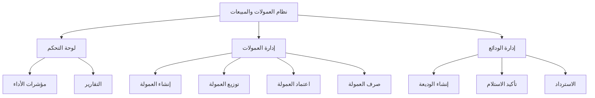

# دليل واجهة برمجة التطبيقات للمطورين - نظام العمولات والمبيعات

## 📋 جدول المحتويات

1. [نظرة عامة على النظام](#نظرة-عامة-على-النظام)
2. [المصادقة والتفويض](#المصادقة-والتفويض)
3. [هيكل الاستجابات](#هيكل-الاستجابات)
4. [رموز الأخطاء](#رموز-الأخطاء)
5. [نقاط النهاية - لوحة التحكم](#نقاط-النهاية---لوحة-التحكم)
6. [نقاط النهاية - العمولات](#نقاط-النهاية---العمولات)
7. [نقاط النهاية - الودائع](#نقاط-النهاية---الودائع)
8. [أمثلة التكامل](#أمثلة-التكامل)
9. [أفضل الممارسات](#أفضل-الممارسات)
10. [حالات الاستخدام الشائعة](#حالات-الاستخدام-الشائعة)
11. [استكشاف الأخطاء وإصلاحها](#استكشاف-الأخطاء-وإصلاحها)

---

## نظرة عامة على النظام

### ما هو نظام العمولات والمبيعات؟

نظام شامل لإدارة عمولات المبيعات العقارية وتوزيعها على فريق المبيعات، بالإضافة إلى إدارة الودائع واستردادها.

### المكونات الرئيسية



### الأدوار والصلاحيات

| الدور | الصلاحيات |
|------|-----------|
| **Admin** | جميع الصلاحيات |
| **Sales Manager** | إنشاء وتوزيع واعتماد العمولات، إدارة الودائع |
| **Accountant** | تأكيد الودائع، صرف العمولات |
| **Sales** | عرض عمولاته الخاصة، إنشاء ودائع |

---

## المصادقة والتفويض

### طريقة المصادقة

يستخدم النظام **Laravel Sanctum** للمصادقة عبر API tokens.

### إعداد الـ Headers

```javascript
const headers = {
  'Authorization': `Bearer ${token}`,
  'Content-Type': 'application/json',
  'Accept': 'application/json',
  'X-Requested-With': 'XMLHttpRequest'
};
```

### مثال على تسجيل الدخول

```javascript
// تسجيل الدخول
const login = async (email, password) => {
  const response = await axios.post('/api/login', {
    email,
    password
  });
  
  const token = response.data.data.token;
  
  // حفظ الـ token
  localStorage.setItem('auth_token', token);
  
  return token;
};

// استخدام الـ token
axios.defaults.headers.common['Authorization'] = `Bearer ${token}`;
```

### التحقق من الصلاحيات

```javascript
// التحقق من صلاحية معينة
const hasPermission = (user, permission) => {
  return user.permissions.includes(permission);
};

// مثال
if (hasPermission(currentUser, 'commissions.create')) {
  // يمكن إنشاء عمولة
}
```

---

## هيكل الاستجابات

### استجابة ناجحة

```json
{
  "success": true,
  "message": "تمت العملية بنجاح",
  "data": {
    // البيانات المطلوبة
  },
  "meta": {
    // معلومات إضافية (اختياري)
  }
}
```

### استجابة مع Pagination

```json
{
  "success": true,
  "message": "تم جلب البيانات بنجاح",
  "data": [
    // عناصر الصفحة الحالية
  ],
  "meta": {
    "pagination": {
      "total": 100,
      "count": 15,
      "per_page": 15,
      "current_page": 1,
      "total_pages": 7,
      "has_more_pages": true
    }
  }
}
```

### استجابة خطأ

```json
{
  "success": false,
  "message": "رسالة الخطأ بالعربية",
  "error_code": "COMM_001",
  "errors": {
    // تفاصيل الأخطاء (في حالة validation)
  }
}
```

---

## رموز الأخطاء

للحصول على قائمة كاملة برموز الأخطاء، راجع [مرجع رموز الأخطاء](./ERROR_CODES_REFERENCE.md).

### الرموز الأساسية

| HTTP Code | المعنى | الاستخدام |
|-----------|--------|-----------|
| 200 | OK | نجاح العملية |
| 201 | Created | تم الإنشاء بنجاح |
| 400 | Bad Request | طلب غير صحيح |
| 401 | Unauthorized | غير مصرح |
| 403 | Forbidden | ممنوع |
| 404 | Not Found | غير موجود |
| 422 | Validation Error | خطأ في التحقق |
| 500 | Server Error | خطأ في الخادم |

---

## نقاط النهاية - لوحة التحكم

### 1. الحصول على مؤشرات الأداء (KPIs)

**Endpoint:** `GET /api/sales/dashboard`

**الوصف:** جلب جميع مؤشرات الأداء الرئيسية للوحة التحكم

**Parameters:**
```javascript
{
  date_from: '2026-01-01',  // اختياري
  date_to: '2026-12-31',    // اختياري
  project_id: 123           // اختياري
}
```

**Response:**
```json
{
  "success": true,
  "message": "تم جلب البيانات بنجاح",
  "data": {
    "units_sold": 45,
    "total_sales_value": 125000000,
    "total_received_deposits": 15000000,
    "total_refunded_deposits": 500000,
    "total_commissions": 3125000,
    "pending_commissions": 625000,
    "approved_commissions": 1875000,
    "paid_commissions": 625000
  }
}
```

**مثال على الاستخدام:**
```javascript
const getDashboardKPIs = async (filters = {}) => {
  try {
    const response = await axios.get('/api/sales/dashboard', {
      params: filters
    });
    return response.data.data;
  } catch (error) {
    console.error('خطأ في جلب مؤشرات الأداء:', error);
    throw error;
  }
};

// الاستخدام
const kpis = await getDashboardKPIs({
  date_from: '2026-01-01',
  date_to: '2026-01-31'
});
console.log(`الوحدات المباعة: ${kpis.units_sold}`);
```

---

### 2. قائمة الوحدات المباعة

**Endpoint:** `GET /api/sales/sold-units`

**الوصف:** جلب قائمة مفصلة بالوحدات المباعة

**Parameters:**
```javascript
{
  date_from: '2026-01-01',
  date_to: '2026-12-31',
  project_id: 123,
  status: 'sold',
  per_page: 15,
  page: 1
}
```

**Response:**
```json
{
  "success": true,
  "message": "تم جلب القائمة بنجاح",
  "data": [
    {
      "id": 1,
      "unit_number": "A-101",
      "project_name": "مشروع النخيل",
      "selling_price": 1500000,
      "sale_date": "2026-01-15",
      "client_name": "أحمد محمد",
      "sales_person": "خالد علي",
      "commission_status": "approved"
    }
  ],
  "meta": {
    "pagination": {
      "total": 45,
      "current_page": 1,
      "per_page": 15,
      "total_pages": 3
    }
  }
}
```

---

### 3. إحصائيات الودائع حسب المشروع

**Endpoint:** `GET /api/sales/deposits/stats/project/{contractId}`

**الوصف:** جلب إحصائيات الودائع لمشروع معين

**Response:**
```json
{
  "success": true,
  "data": {
    "project_id": 123,
    "project_name": "مشروع النخيل",
    "total_deposits": 25,
    "total_amount": 5000000,
    "received_amount": 4500000,
    "refunded_amount": 500000,
    "pending_count": 5,
    "received_count": 18,
    "refunded_count": 2
  }
}
```

---

### 4. إحصائيات العمولات حسب الموظف

**Endpoint:** `GET /api/sales/commissions/stats/employee/{userId}`

**Parameters:**
```javascript
{
  date_from: '2026-01-01',
  date_to: '2026-12-31'
}
```

**Response:**
```json
{
  "success": true,
  "data": {
    "employee_id": 456,
    "employee_name": "خالد علي",
    "total_commissions": 125000,
    "pending_amount": 25000,
    "approved_amount": 75000,
    "paid_amount": 25000,
    "distributions_count": 15,
    "breakdown_by_type": {
      "lead_generation": 37500,
      "persuasion": 31250,
      "closing": 37500,
      "management": 18750
    }
  }
}
```

---

### 5. تقرير العمولات الشهري

**Endpoint:** `GET /api/sales/commissions/monthly-report`

**Parameters:**
```javascript
{
  year: 2026,
  month: 1  // 1-12
}
```

**Response:**
```json
{
  "success": true,
  "data": {
    "year": 2026,
    "month": 1,
    "month_name": "يناير",
    "total_commissions": 625000,
    "total_distributions": 45,
    "by_employee": [
      {
        "employee_id": 456,
        "employee_name": "خالد علي",
        "total_amount": 125000,
        "distributions_count": 9
      }
    ],
    "by_type": {
      "lead_generation": 187500,
      "persuasion": 156250,
      "closing": 187500,
      "management": 93750
    }
  }
}
```

---

## نقاط النهاية - العمولات

### 1. قائمة العمولات

**Endpoint:** `GET /api/sales/commissions`

**الوصف:** جلب قائمة العمولات مع إمكانية التصفية

**Parameters:**
```javascript
{
  status: 'pending',  // pending, approved, paid
  project_id: 123,
  date_from: '2026-01-01',
  date_to: '2026-12-31',
  per_page: 15,
  page: 1
}
```

**Response:**
```json
{
  "success": true,
  "message": "تم جلب قائمة العمولات بنجاح",
  "data": [
    {
      "id": 1,
      "contract_unit_id": 101,
      "sales_reservation_id": 201,
      "final_selling_price": 1500000,
      "commission_percentage": 2.5,
      "total_amount": 37500,
      "vat": 5625,
      "marketing_expenses": 2000,
      "bank_fees": 500,
      "net_amount": 29375,
      "commission_source": "owner",
      "status": "pending",
      "created_at": "2026-01-15T10:30:00Z",
      "contract_unit": {
        "id": 101,
        "unit_number": "A-101"
      },
      "sales_reservation": {
        "id": 201,
        "client_name": "أحمد محمد"
      },
      "distributions": []
    }
  ],
  "meta": {
    "pagination": {
      "total": 25,
      "current_page": 1,
      "per_page": 15,
      "total_pages": 2
    }
  }
}
```

**مثال على الاستخدام:**
```javascript
const getCommissions = async (filters = {}) => {
  try {
    const response = await axios.get('/api/sales/commissions', {
      params: filters
    });
    return response.data;
  } catch (error) {
    handleError(error);
  }
};

// استخدام مع تصفية
const pendingCommissions = await getCommissions({
  status: 'pending',
  per_page: 20
});
```

---

### 2. إنشاء عمولة جديدة

**Endpoint:** `POST /api/sales/commissions`

**الصلاحيات المطلوبة:** `commissions.create`

**Request Body:**
```json
{
  "contract_unit_id": 101,
  "sales_reservation_id": 201,
  "final_selling_price": 1500000,
  "commission_percentage": 2.5,
  "commission_source": "owner",
  "team_responsible": "فريق المبيعات أ"
}
```

**Validation Rules:**
```javascript
{
  contract_unit_id: 'required|exists:contract_units,id',
  sales_reservation_id: 'required|exists:sales_reservations,id',
  final_selling_price: 'required|numeric|min:1',
  commission_percentage: 'required|numeric|min:0|max:100',
  commission_source: 'required|in:owner,buyer',
  team_responsible: 'nullable|string|max:255'
}
```

**Response (201 Created):**
```json
{
  "success": true,
  "message": "تم إنشاء العمولة بنجاح",
  "data": {
    "id": 1,
    "contract_unit_id": 101,
    "sales_reservation_id": 201,
    "final_selling_price": 1500000,
    "commission_percentage": 2.5,
    "total_amount": 37500,
    "vat": 5625,
    "marketing_expenses": 0,
    "bank_fees": 0,
    "net_amount": 31875,
    "commission_source": "owner",
    "status": "pending",
    "created_at": "2026-01-15T10:30:00Z"
  }
}
```

**مثال على الاستخدام:**
```javascript
const createCommission = async (commissionData) => {
  try {
    const response = await axios.post('/api/sales/commissions', commissionData);
    
    console.log('تم إنشاء العمولة:', response.data.data);
    return response.data.data;
  } catch (error) {
    if (error.response?.data?.error_code === 'COMM_001') {
      alert('عمولة موجودة بالفعل لهذه الوحدة');
    } else if (error.response?.status === 422) {
      // أخطاء التحقق
      const errors = error.response.data.errors;
      displayValidationErrors(errors);
    }
    throw error;
  }
};

// الاستخدام
const newCommission = await createCommission({
  contract_unit_id: 101,
  sales_reservation_id: 201,
  final_selling_price: 1500000,
  commission_percentage: 2.5,
  commission_source: 'owner'
});
```

---

### 3. تفاصيل عمولة

**Endpoint:** `GET /api/sales/commissions/{id}`

**Response:**
```json
{
  "success": true,
  "message": "تم جلب تفاصيل العمولة بنجاح",
  "data": {
    "id": 1,
    "contract_unit_id": 101,
    "sales_reservation_id": 201,
    "final_selling_price": 1500000,
    "commission_percentage": 2.5,
    "total_amount": 37500,
    "vat": 5625,
    "marketing_expenses": 2000,
    "bank_fees": 500,
    "net_amount": 29375,
    "commission_source": "owner",
    "status": "approved",
    "created_at": "2026-01-15T10:30:00Z",
    "updated_at": "2026-01-16T14:20:00Z",
    "contract_unit": {
      "id": 101,
      "unit_number": "A-101",
      "project_name": "مشروع النخيل"
    },
    "sales_reservation": {
      "id": 201,
      "client_name": "أحمد محمد",
      "client_mobile": "0501234567"
    },
    "distributions": [
      {
        "id": 1,
        "type": "lead_generation",
        "percentage": 30,
        "amount": 8812.5,
        "status": "approved",
        "user": {
          "id": 456,
          "name": "خالد علي"
        }
      },
      {
        "id": 2,
        "type": "persuasion",
        "percentage": 25,
        "amount": 7343.75,
        "status": "approved",
        "user": {
          "id": 457,
          "name": "سارة أحمد"
        }
      }
    ]
  }
}
```

---

### 4. تحديث مصاريف العمولة

**Endpoint:** `PUT /api/sales/commissions/{id}/expenses`

**الصلاحيات المطلوبة:** `commissions.update`

**Request Body:**
```json
{
  "marketing_expenses": 2000,
  "bank_fees": 500
}
```

**Validation:**
- يجب أن تكون العمولة في حالة `pending`
- المصاريف يجب ألا تتجاوز مبلغ العمولة الإجمالي

**Response:**
```json
{
  "success": true,
  "message": "تم تحديث مصاريف العمولة بنجاح",
  "data": {
    "id": 1,
    "marketing_expenses": 2000,
    "bank_fees": 500,
    "net_amount": 29375
  }
}
```

---

### 5. توزيع العمولة

**Endpoint:** `POST /api/sales/commissions/{id}/distributions`

**الصلاحيات المطلوبة:** `commissions.update`

**Request Body:**
```json
{
  "distributions": [
    {
      "user_id": 456,
      "type": "lead_generation",
      "percentage": 30,
      "bank_account": "SA1234567890",
      "notes": "ملاحظات اختيارية"
    },
    {
      "user_id": 457,
      "type": "persuasion",
      "percentage": 25
    },
    {
      "user_id": 458,
      "type": "closing",
      "percentage": 30
    },
    {
      "user_id": 459,
      "type": "management",
      "percentage": 15
    }
  ]
}
```

**Validation Rules:**
```javascript
{
  'distributions': 'required|array|min:1',
  'distributions.*.user_id': 'required_without:distributions.*.external_name',
  'distributions.*.external_name': 'required_without:distributions.*.user_id',
  'distributions.*.type': 'required|in:lead_generation,persuasion,closing,...',
  'distributions.*.percentage': 'required|numeric|min:0|max:100',
  'distributions.*.bank_account': 'nullable|string|max:50',
  // مجموع النسب يجب أن يساوي 100%
}
```

**Response:**
```json
{
  "success": true,
  "message": "تم توزيع العمولة بنجاح",
  "data": {
    "commission_id": 1,
    "distributions": [
      {
        "id": 1,
        "user_id": 456,
        "type": "lead_generation",
        "percentage": 30,
        "amount": 8812.5,
        "status": "pending"
      }
    ]
  }
}
```

**مثال على الاستخدام:**
```javascript
const distributeCommission = async (commissionId, distributions) => {
  // التحقق من أن المجموع = 100%
  const total = distributions.reduce((sum, d) => sum + d.percentage, 0);
  if (Math.abs(total - 100) > 0.01) {
    throw new Error('مجموع النسب يجب أن يساوي 100%');
  }
  
  try {
    const response = await axios.post(
      `/api/sales/commissions/${commissionId}/distributions`,
      { distributions }
    );
    return response.data.data;
  } catch (error) {
    if (error.response?.data?.error_code === 'COMM_003') {
      alert('مجموع النسب لا يساوي 100%');
    } else if (error.response?.data?.error_code === 'COMM_005') {
      alert('لا يمكن توزيع العمولة على نفس الموظف أكثر من مرة');
    }
    throw error;
  }
};
```

---

### 6. اعتماد توزيع

**Endpoint:** `POST /api/sales/commissions/distributions/{distributionId}/approve`

**الصلاحيات المطلوبة:** `commission_distributions.approve`

**Response:**
```json
{
  "success": true,
  "message": "تم اعتماد التوزيع بنجاح",
  "data": {
    "id": 1,
    "status": "approved",
    "approved_by": 789,
    "approved_at": "2026-01-16T10:00:00Z"
  }
}
```

---

### 7. رفض توزيع

**Endpoint:** `POST /api/sales/commissions/distributions/{distributionId}/reject`

**Request Body:**
```json
{
  "reason": "سبب الرفض (اختياري)"
}
```

**Response:**
```json
{
  "success": true,
  "message": "تم رفض التوزيع",
  "data": {
    "id": 1,
    "status": "rejected",
    "notes": "سبب الرفض"
  }
}
```

---

### 8. اعتماد العمولة

**Endpoint:** `POST /api/sales/commissions/{id}/approve`

**الصلاحيات المطلوبة:** `commissions.approve`

**Response:**
```json
{
  "success": true,
  "message": "تم اعتماد العمولة بنجاح",
  "data": {
    "id": 1,
    "status": "approved"
  }
}
```

---

### 9. صرف العمولة

**Endpoint:** `POST /api/sales/commissions/{id}/mark-paid`

**الصلاحيات المطلوبة:** `commissions.mark_paid`

**Response:**
```json
{
  "success": true,
  "message": "تم صرف العمولة بنجاح",
  "data": {
    "id": 1,
    "status": "paid"
  }
}
```

---

### 10. ملخص العمولة

**Endpoint:** `GET /api/sales/commissions/{id}/summary`

**Response:**
```json
{
  "success": true,
  "data": {
    "commission": {
      "id": 1,
      "total_amount": 37500,
      "vat": 5625,
      "net_amount": 29375,
      "status": "approved"
    },
    "distributions_summary": {
      "total_distributions": 4,
      "pending_count": 0,
      "approved_count": 4,
      "rejected_count": 0,
      "total_distributed": 29375
    },
    "by_type": {
      "lead_generation": 8812.5,
      "persuasion": 7343.75,
      "closing": 8812.5,
      "management": 4406.25
    }
  }
}
```

---

## نقاط النهاية - الودائع

### 1. قائمة الودائع

**Endpoint:** `GET /api/sales/deposits`

**Parameters:**
```javascript
{
  status: 'pending',  // pending, received, refunded, confirmed
  from: '2026-01-01',
  to: '2026-12-31',
  per_page: 15,
  page: 1
}
```

**Response:**
```json
{
  "success": true,
  "message": "تم جلب قائمة الودائع بنجاح",
  "data": [
    {
      "id": 1,
      "sales_reservation_id": 201,
      "contract_id": 301,
      "contract_unit_id": 101,
      "amount": 50000,
      "payment_method": "bank_transfer",
      "client_name": "أحمد محمد",
      "payment_date": "2026-01-15",
      "commission_source": "owner",
      "status": "received",
      "created_at": "2026-01-15T09:00:00Z"
    }
  ],
  "meta": {
    "pagination": {
      "total": 50,
      "current_page": 1,
      "per_page": 15,
      "total_pages": 4
    }
  }
}
```

---

### 2. إنشاء وديعة جديدة

**Endpoint:** `POST /api/sales/deposits`

**الصلاحيات المطلوبة:** `deposits.create`

**Request Body:**
```json
{
  "sales_reservation_id": 201,
  "contract_id": 301,
  "contract_unit_id": 101,
  "amount": 50000,
  "payment_method": "bank_transfer",
  "client_name": "أحمد محمد",
  "payment_date": "2026-01-15",
  "commission_source": "owner",
  "notes": "ملاحظات اختيارية"
}
```

**Validation Rules:**
```javascript
{
  sales_reservation_id: 'required|exists:sales_reservations,id',
  contract_id: 'required|exists:contracts,id',
  contract_unit_id: 'required|exists:contract_units,id',
  amount: 'required|numeric|min:1',
  payment_method: 'required|in:bank_transfer,cash,bank_financing',
  client_name: 'required|string|max:255',
  payment_date: 'required|date|before_or_equal:today',
  commission_source: 'required|in:owner,buyer',
  notes: 'nullable|string|max:1000'
}
```

**Response (201 Created):**
```json
{
  "success": true,
  "message": "تم إنشاء الوديعة بنجاح",
  "data": {
    "id": 1,
    "sales_reservation_id": 201,
    "amount": 50000,
    "payment_method": "bank_transfer",
    "status": "pending",
    "created_at": "2026-01-15T09:00:00Z"
  }
}
```

**مثال على الاستخدام:**
```javascript
const createDeposit = async (depositData) => {
  try {
    const response = await axios.post('/api/sales/deposits', depositData);
    return response.data.data;
  } catch (error) {
    if (error.response?.data?.error_code === 'DEP_011') {
      alert('تاريخ الدفع لا يمكن أن يكون في المستقبل');
    } else if (error.response?.data?.error_code === 'DEP_013') {
      alert('الوحدة المحددة لا تنتمي إلى هذا المشروع');
    }
    throw error;
  }
};
```

---

### 3. تفاصيل وديعة

**Endpoint:** `GET /api/sales/deposits/{id}`

**Response:**
```json
{
  "success": true,
  "data": {
    "id": 1,
    "sales_reservation_id": 201,
    "contract_id": 301,
    "contract_unit_id": 101,
    "amount": 50000,
    "payment_method": "bank_transfer",
    "client_name": "أحمد محمد",
    "payment_date": "2026-01-15",
    "commission_source": "owner",
    "status": "received",
    "confirmed_by": null,
    "confirmed_at": null,
    "notes": "ملاحظات",
    "created_at": "2026-01-15T09:00:00Z",
    "sales_reservation": {
      "id": 201,
      "reservation_type": "confirmed_reservation"
    },
    "contract": {
      "id": 301,
      "project_name": "مشروع النخيل"
    },
    "contract_unit": {
      "id": 101,
      "unit_number": "A-101"
    }
  }
}
```

---

### 4. تحديث وديعة

**Endpoint:** `PUT /api/sales/deposits/{id}`

**الصلاحيات المطلوبة:** `deposits.update`

**Request Body:**
```json
{
  "amount": 55000,
  "payment_method": "cash",
  "notes": "تحديث الملاحظات"
}
```

**Validation:**
- يمكن تحديث الودائع في حالة `pending` أو `received` فقط

**Response:**
```json
{
  "success": true,
  "message": "تم تحديث الوديعة بنجاح",
  "data": {
    "id": 1,
    "amount": 55000,
    "payment_method": "cash"
  }
}
```

---

### 5. تأكيد استلام الوديعة

**Endpoint:** `POST /api/sales/deposits/{id}/confirm-receipt`

**الصلاحيات المطلوبة:** `deposits.confirm_receipt`

**Response:**
```json
{
  "success": true,
  "message": "تم تأكيد استلام الوديعة بنجاح",
  "data": {
    "id": 1,
    "status": "confirmed",
    "confirmed_by": 789,
    "confirmed_at": "2026-01-16T10:00:00Z"
  }
}
```

---

### 6. وضع علامة "تم الاستلام"

**Endpoint:** `POST /api/sales/deposits/{id}/mark-received`

**Response:**
```json
{
  "success": true,
  "message": "تم وضع علامة استلام الوديعة",
  "data": {
    "id": 1,
    "status": "received"
  }
}
```

---

### 7. استرداد وديعة

**Endpoint:** `POST /api/sales/deposits/{id}/refund`

**الصلاحيات المطلوبة:** `deposits.refund`

**Request Body:**
```json
{
  "reason": "سبب الاسترداد"
}
```

**Validation:**
- يمكن استرداد الودائع من مصدر `owner` فقط
- يجب أن تكون الوديعة في حالة `received` أو `confirmed`

**Response:**
```json
{
  "success": true,
  "message": "تم استرداد الوديعة بنجاح",
  "data": {
    "id": 1,
    "status": "refunded"
  }
}
```

**مثال على الاستخدام:**
```javascript
const refundDeposit = async (depositId, reason) => {
  try {
    const response = await axios.post(
      `/api/sales/deposits/${depositId}/refund`,
      { reason }
    );
    return response.data.data;
  } catch (error) {
    const errorCode = error.response?.data?.error_code;
    
    if (errorCode === 'DEP_002') {
      alert('لا يمكن استرداد وديعة من مصدر المشتري');
    } else if (errorCode === 'DEP_003') {
      alert('تم استرداد الوديعة بالفعل');
    } else if (errorCode === 'DEP_010') {
      alert('يجب تأكيد الوديعة أولاً قبل الاسترداد');
    }
    throw error;
  }
};
```

---

### 8. التحقق من إمكانية الاسترداد

**Endpoint:** `GET /api/sales/deposits/{id}/can-refund`

**Response:**
```json
{
  "success": true,
  "data": {
    "can_refund": true,
    "reason": "الوديعة من مصدر المالك ويمكن استردادها"
  }
}
```

أو:

```json
{
  "success": true,
  "data": {
    "can_refund": false,
    "reason": "لا يمكن استرداد وديعة من مصدر المشتري"
  }
}
```

---

### 9. حذف وديعة

**Endpoint:** `DELETE /api/sales/deposits/{id}`

**الصلاحيات المطلوبة:** `deposits.delete`

**Validation:**
- يمكن حذف الودائع في حالة `pending` فقط

**Response:**
```json
{
  "success": true,
  "message": "تم حذف الوديعة بنجاح"
}
```

---

### 10. تأكيد ودائع متعددة

**Endpoint:** `POST /api/sales/deposits/bulk-confirm`

**Request Body:**
```json
{
  "deposit_ids": [1, 2, 3, 4, 5]
}
```

**Response:**
```json
{
  "success": true,
  "message": "تم تأكيد 5 ودائع بنجاح",
  "data": {
    "confirmed_count": 5,
    "failed_count": 0
  }
}
```

---

### 11. ودائع حسب الحجز

**Endpoint:** `GET /api/sales/deposits/by-reservation/{salesReservationId}`

**Response:**
```json
{
  "success": true,
  "data": [
    {
      "id": 1,
      "amount": 50000,
      "status": "received",
      "payment_date": "2026-01-15"
    }
  ]
}
```

---

### 12. الودائع القابلة للاسترداد

**Endpoint:** `GET /api/sales/deposits/refundable/project/{contractId}`

**Response:**
```json
{
  "success": true,
  "data": [
    {
      "id": 1,
      "amount": 50000,
      "client_name": "أحمد محمد",
      "payment_date": "2026-01-15",
      "commission_source": "owner",
      "status": "received"
    }
  ]
}
```

---

### 13. قائمة المتابعة

**Endpoint:** `GET /api/sales/deposits/follow-up`

**الوصف:** جلب الودائع التي تحتاج متابعة (pending)

**Response:**
```json
{
  "success": true,
  "data": [
    {
      "id": 1,
      "amount": 50000,
      "client_name": "أحمد محمد",
      "payment_date": "2026-01-15",
      "days_pending": 5,
      "status": "pending"
    }
  ]
}
```

---

## أمثلة التكامل

### مثال 1: إنشاء عمولة كاملة مع التوزيع

```javascript
// دالة شاملة لإنشاء عمولة مع توزيعها
const createFullCommission = async (unitData, distributions) => {
  try {
    // 1. إنشاء العمولة
    const commission = await axios.post('/api/sales/commissions', {
      contract_unit_id: unitData.unitId,
      sales_reservation_id: unitData.reservationId,
      final_selling_price: unitData.price,
      commission_percentage: 2.5,
      commission_source: 'owner'
    });
    
    const commissionId = commission.data.data.id;
    console.log('تم إنشاء العمولة:', commissionId);
    
    // 2. إضافة المصاريف (اختياري)
    if (unitData.expenses) {
      await axios.put(`/api/sales/commissions/${commissionId}/expenses`, {
        marketing_expenses: unitData.expenses.marketing,
        bank_fees: unitData.expenses.bankFees
      });
      console.log('تم تحديث المصاريف');
    }
    
    // 3. توزيع العمولة
    await axios.post(`/api/sales/commissions/${commissionId}/distributions`, {
      distributions: distributions
    });
    console.log('تم توزيع العمولة');
    
    // 4. جلب الملخص
    const summary = await axios.get(`/api/sales/commissions/${commissionId}/summary`);
    
    return {
      success: true,
      commission: commission.data.data,
      summary: summary.data.data
    };
    
  } catch (error) {
    console.error('خطأ في إنشاء العمولة:', error);
    throw error;
  }
};

// الاستخدام
const result = await createFullCommission(
  {
    unitId: 101,
    reservationId: 201,
    price: 1500000,
    expenses: {
      marketing: 2000,
      bankFees: 500
    }
  },
  [
    { user_id: 456, type: 'lead_generation', percentage: 30 },
    { user_id: 457, type: 'persuasion', percentage: 25 },
    { user_id: 458, type: 'closing', percentage: 30 },
    { user_id: 459, type: 'management', percentage: 15 }
  ]
);
```

---

### مثال 2: إدارة دورة حياة الوديعة

```javascript
// دالة لإدارة دورة حياة الوديعة الكاملة
const manageDepositLifecycle = async (depositData) => {
  try {
    // 1. إنشاء الوديعة
    const deposit = await axios.post('/api/sales/deposits', depositData);
    const depositId = deposit.data.data.id;
    console.log('تم إنشاء الوديعة:', depositId);
    
    // 2. وضع علامة "تم الاستلام" (بعد التحقق الفعلي)
    await axios.post(`/api/sales/deposits/${depositId}/mark-received`);
    console.log('تم وضع علامة الاستلام');
    
    // 3. تأكيد الاستلام (من قبل المحاسب)
    await axios.post(`/api/sales/deposits/${depositId}/confirm-receipt`);
    console.log('تم تأكيد الاستلام');
    
    // 4. التحقق من إمكانية الاسترداد
    const refundCheck = await axios.get(`/api/sales/deposits/${depositId}/can-refund`);
    
    if (refundCheck.data.data.can_refund) {
      console.log('يمكن استرداد الوديعة');
      // يمكن عرض زر الاسترداد للمستخدم
    }
    
    return {
      success: true,
      deposit: deposit.data.data
    };
    
  } catch (error) {
    console.error('خطأ في إدارة الوديعة:', error);
    throw error;
  }
};
```

---

### مثال 3: لوحة تحكم تفاعلية

```javascript
// دالة لجلب وعرض بيانات لوحة التحكم
const loadDashboard = async (filters = {}) => {
  try {
    // جلب المؤشرات الرئيسية
    const kpis = await axios.get('/api/sales/dashboard', { params: filters });
    
    // جلب الوحدات المباعة
    const soldUnits = await axios.get('/api/sales/sold-units', { 
      params: { ...filters, per_page: 10 } 
    });
    
    // جلب التقرير الشهري
    const monthlyReport = await axios.get('/api/sales/commissions/monthly-report', {
      params: {
        year: new Date().getFullYear(),
        month: new Date().getMonth() + 1
      }
    });
    
    return {
      kpis: kpis.data.data,
      soldUnits: soldUnits.data.data,
      monthlyReport: monthlyReport.data.data
    };
    
  } catch (error) {
    console.error('خطأ في تحميل لوحة التحكم:', error);
    throw error;
  }
};

// الاستخدام مع React/Vue
useEffect(() => {
  loadDashboard({ date_from: '2026-01-01', date_to: '2026-01-31' })
    .then(data => {
      setKpis(data.kpis);
      setSoldUnits(data.soldUnits);
      setMonthlyReport(data.monthlyReport);
    });
}, []);
```

---

## أفضل الممارسات

### 1. معالجة الأخطاء

```javascript
// دالة مركزية لمعالجة الأخطاء
const handleApiError = (error) => {
  if (!error.response) {
    // خطأ في الشبكة
    return {
      message: 'خطأ في الاتصال بالخادم',
      type: 'network'
    };
  }
  
  const { status, data } = error.response;
  
  switch (status) {
    case 401:
      // إعادة توجيه لتسجيل الدخول
      window.location.href = '/login';
      return { message: 'يجب تسجيل الدخول', type: 'auth' };
      
    case 403:
      return { message: 'صلاحيات غير كافية', type: 'permission' };
      
    case 404:
      return { message: 'غير موجود', type: 'notfound' };
      
    case 422:
      return { 
        message: 'خطأ في البيانات المدخلة', 
        type: 'validation',
        errors: data.errors 
      };
      
    case 409:
      return { 
        message: data.message, 
        type: 'conflict',
        code: data.error_code 
      };
      
    default:
      return { message: data.message || 'حدث خطأ', type: 'error' };
  }
};

// الاستخدام
try {
  const result = await createCommission(data);
} catch (error) {
  const errorInfo = handleApiError(error);
  displayError(errorInfo);
}
```

---

### 2. التحقق من البيانات قبل الإرسال

```javascript
// دالة للتحقق من توزيع العمولة
const validateDistributions = (distributions) => {
  const errors = [];
  
  // التحقق من المجموع = 100%
  const total = distributions.reduce((sum, d) => sum + d.percentage, 0);
  if (Math.abs(total - 100) > 0.01) {
    errors.push('مجموع النسب يجب أن يساوي 100%');
  }
  
  // التحقق من عدم التكرار
  const userIds = distributions
    .filter(d => d.user_id)
    .map(d => d.user_id);
  const uniqueIds = new Set(userIds);
  if (userIds.length !== uniqueIds.size) {
    errors.push('لا يمكن توزيع العمولة على نفس الموظف أكثر من مرة');
  }
  
  // التحقق من المسوق الخارجي
  distributions.forEach((d, index) => {
    if (d.type === 'external_marketer') {
      if (!d.external_name) {
        errors.push(`التوزيع ${index + 1}: اسم المسوق الخارجي مطلوب`);
      }
      if (!d.bank_account) {
        errors.push(`التوزيع ${index + 1}: رقم الحساب البنكي مطلوب`);
      }
    }
  });
  
  return {
    isValid: errors.length === 0,
    errors
  };
};

// الاستخدام
const validation = validateDistributions(distributions);
if (!validation.isValid) {
  alert(validation.errors.join('\n'));
  return;
}
```

---

### 3. استخدام Interceptors

```javascript
// إعداد Axios interceptors
axios.interceptors.request.use(
  config => {
    // إضافة الـ token تلقائياً
    const token = localStorage.getItem('auth_token');
    if (token) {
      config.headers.Authorization = `Bearer ${token}`;
    }
    
    // إضافة timestamp
    config.headers['X-Request-Time'] = new Date().toISOString();
    
    return config;
  },
  error => Promise.reject(error)
);

axios.interceptors.response.use(
  response => response,
  error => {
    // معالجة انتهاء الجلسة
    if (error.response?.status === 401) {
      localStorage.removeItem('auth_token');
      window.location.href = '/login';
    }
    
    return Promise.reject(error);
  }
);
```

---

### 4. التخزين المؤقت (Caching)

```javascript
// دالة مع تخزين مؤقت
const cachedApiCall = (() => {
  const cache = new Map();
  const CACHE_DURATION = 5 * 60 * 1000; // 5 دقائق
  
  return async (url, params = {}) => {
    const cacheKey = `${url}?${JSON.stringify(params)}`;
    const cached = cache.get(cacheKey);
    
    // التحقق من صلاحية الكاش
    if (cached && Date.now() - cached.timestamp < CACHE_DURATION) {
      console.log('استخدام البيانات المخزنة');
      return cached.data;
    }
    
    // جلب البيانات الجديدة
    const response = await axios.get(url, { params });
    cache.set(cacheKey, {
      data: response.data,
      timestamp: Date.now()
    });
    
    return response.data;
  };
})();

// الاستخدام
const kpis = await cachedApiCall('/api/sales/dashboard', { 
  date_from: '2026-01-01' 
});
```

---

### 5. معالجة Pagination

```javascript
// دالة لجلب جميع الصفحات
const fetchAllPages = async (url, params = {}) => {
  let allData = [];
  let currentPage = 1;
  let hasMore = true;
  
  while (hasMore) {
    const response = await axios.get(url, {
      params: { ...params, page: currentPage, per_page: 50 }
    });
    
    allData = allData.concat(response.data.data);
    hasMore = response.data.meta.pagination.has_more_pages;
    currentPage++;
  }
  
  return allData;
};

// الاستخدام
const allCommissions = await fetchAllPages('/api/sales/commissions', {
  status: 'approved'
});
console.log(`تم جلب ${allCommissions.length} عمولة`);
```

---

## حالات الاستخدام الشائعة

### حالة 1: إنشاء عمولة بعد بيع وحدة

```javascript
const handleUnitSold = async (unitData) => {
  try {
    // 1. إنشاء العمولة
    const commission = await axios.post('/api/sales/commissions', {
      contract_unit_id: unitData.id,
      sales_reservation_id: unitData.reservationId,
      final_selling_price: unitData.sellingPrice,
      commission_percentage: 2.5,
      commission_source: 'owner'
    });
    
    // 2. إضافة المصاريف إذا وجدت
    if (unitData.marketingExpenses || unitData.bankFees) {
      await axios.put(
        `/api/sales/commissions/${commission.data.data.id}/expenses`,
        {
          marketing_expenses: unitData.marketingExpenses || 0,
          bank_fees: unitData.bankFees || 0
        }
      );
    }
    
    // 3. توزيع العمولة على الفريق
    const distributions = calculateDistributions(unitData.salesTeam);
    await axios.post(
      `/api/sales/commissions/${commission.data.data.id}/distributions`,
      { distributions }
    );
    
    // 4. إشعار المستخدم
    showNotification('تم إنشاء العمولة وتوزيعها بنجاح', 'success');
    
    return commission.data.data;
    
  } catch (error) {
    const errorInfo = handleApiError(error);
    showNotification(errorInfo.message, 'error');
    throw error;
  }
};

// دالة مساعدة لحساب التوزيعات
const calculateDistributions = (salesTeam) => {
  return [
    {
      user_id: salesTeam.marketer,
      type: 'lead_generation',
      percentage: 30
    },
    {
      user_id: salesTeam.persuader,
      type: 'persuasion',
      percentage: 25
    },
    {
      user_id: salesTeam.closer,
      type: 'closing',
      percentage: 30
    },
    {
      user_id: salesTeam.manager,
      type: 'management',
      percentage: 15
    }
  ];
};
```

---

### حالة 2: اعتماد عمولة مع جميع توزيعاتها

```javascript
const approveCommissionWithDistributions = async (commissionId) => {
  try {
    // 1. جلب تفاصيل العمولة
    const commission = await axios.get(`/api/sales/commissions/${commissionId}`);
    const distributions = commission.data.data.distributions;
    
    // 2. اعتماد جميع التوزيعات
    for (const distribution of distributions) {
      if (distribution.status === 'pending') {
        await axios.post(
          `/api/sales/commissions/distributions/${distribution.id}/approve`
        );
      }
    }
    
    // 3. اعتماد العمولة نفسها
    await axios.post(`/api/sales/commissions/${commissionId}/approve`);
    
    showNotification('تم اعتماد العمولة وجميع توزيعاتها', 'success');
    
  } catch (error) {
    showNotification('خطأ في اعتماد العمولة', 'error');
    throw error;
  }
};
```

---

### حالة 3: استرداد وديعة بعد إلغاء حجز

```javascript
const handleReservationCancellation = async (reservationId) => {
  try {
    // 1. جلب الودائع المرتبطة بالحجز
    const deposits = await axios.get(
      `/api/sales/deposits/by-reservation/${reservationId}`
    );
    
    // 2. التحقق من إمكانية الاسترداد لكل وديعة
    for (const deposit of deposits.data.data) {
      const canRefund = await axios.get(
        `/api/sales/deposits/${deposit.id}/can-refund`
      );
      
      if (canRefund.data.data.can_refund) {
        // 3. استرداد الوديعة
        await axios.post(
          `/api/sales/deposits/${deposit.id}/refund`,
          { reason: 'إلغاء الحجز' }
        );
        
        console.log(`تم استرداد الوديعة ${deposit.id}`);
      } else {
        console.log(`لا يمكن استرداد الوديعة ${deposit.id}: ${canRefund.data.data.reason}`);
      }
    }
    
    showNotification('تم معالجة الودائع', 'success');
    
  } catch (error) {
    showNotification('خطأ في معالجة الودائع', 'error');
    throw error;
  }
};
```

---

### حالة 4: تقرير شهري للموظف

```javascript
const generateEmployeeMonthlyReport = async (employeeId, year, month) => {
  try {
    // 1. جلب إحصائيات الموظف
    const stats = await axios.get(
      `/api/sales/commissions/stats/employee/${employeeId}`,
      {
        params: {
          date_from: `${year}-${month.toString().padStart(2, '0')}-01`,
          date_to: `${year}-${month.toString().padStart(2, '0')}-31`
        }
      }
    );
    
    // 2. جلب التقرير الشهري العام
    const monthlyReport = await axios.get(
      '/api/sales/commissions/monthly-report',
      { params: { year, month } }
    );
    
    // 3. تجميع البيانات
    const report = {
      employee: stats.data.data,
      overall: monthlyReport.data.data,
      performance: calculatePerformance(stats.data.data, monthlyReport.data.data)
    };
    
    return report;
    
  } catch (error) {
    console.error('خطأ في إنشاء التقرير:', error);
    throw error;
  }
};

const calculatePerformance = (employeeStats, overallStats) => {
  const employeeTotal = employeeStats.total_commissions;
  const overallTotal = overallStats.total_commissions;
  const percentage = (employeeTotal / overallTotal * 100).toFixed(2);
  
  return {
    percentage: percentage,
    rank: employeeStats.rank || 'N/A',
    comparison: `${percentage}% من إجمالي العمولات`
  };
};
```

---

## استكشاف الأخطاء وإصلاحها

### مشكلة 1: خطأ 401 - Unauthorized

**السبب:** انتهاء صلاحية الـ token أو عدم إرساله

**الحل:**
```javascript
// التحقق من وجود الـ token
const token = localStorage.getItem('auth_token');
if (!token) {
  window.location.href = '/login';
  return;
}

// إضافة الـ token للطلبات
axios.defaults.headers.common['Authorization'] = `Bearer ${token}`;

// معالجة انتهاء الصلاحية
axios.interceptors.response.use(
  response => response,
  error => {
    if (error.response?.status === 401) {
      localStorage.removeItem('auth_token');
      window.location.href = '/login';
    }
    return Promise.reject(error);
  }
);
```

---

### مشكلة 2: خطأ 422 - Validation Error

**السبب:** بيانات غير صحيحة

**الحل:**
```javascript
try {
  await axios.post('/api/sales/commissions', data);
} catch (error) {
  if (error.response?.status === 422) {
    const errors = error.response.data.errors;
    
    // عرض الأخطاء للمستخدم
    Object.keys(errors).forEach(field => {
      const errorMessages = errors[field];
      showFieldError(field, errorMessages.join(', '));
    });
  }
}

// دالة لعرض خطأ الحقل
const showFieldError = (fieldName, message) => {
  const fieldElement = document.querySelector(`[name="${fieldName}"]`);
  if (fieldElement) {
    const errorDiv = document.createElement('div');
    errorDiv.className = 'error-message';
    errorDiv.textContent = message;
    fieldElement.parentElement.appendChild(errorDiv);
  }
};
```

---

### مشكلة 3: خطأ COMM_003 - مجموع التوزيع لا يساوي 100%

**السبب:** خطأ في حساب النسب

**الحل:**
```javascript
// دالة لضبط النسب تلقائياً
const adjustPercentages = (distributions) => {
  const total = distributions.reduce((sum, d) => sum + d.percentage, 0);
  
  if (Math.abs(total - 100) < 0.01) {
    return distributions; // صحيح بالفعل
  }
  
  // ضبط النسبة الأخيرة
  const diff = 100 - total;
  distributions[distributions.length - 1].percentage += diff;
  
  return distributions;
};

// الاستخدام
let distributions = [
  { type: 'lead_generation', percentage: 30 },
  { type: 'persuasion', percentage: 25 },
  { type: 'closing', percentage: 30 },
  { type: 'management', percentage: 14.99 } // خطأ في الحساب
];

distributions = adjustPercentages(distributions);
// الآن management = 15.01 والمجموع = 100
```

---

### مشكلة 4: بطء في تحميل البيانات

**الحل:**
```javascript
// استخدام التحميل التدريجي
const loadDataProgressively = async () => {
  // 1. تحميل البيانات الأساسية أولاً
  const kpis = await axios.get('/api/sales/dashboard');
  updateUI({ kpis: kpis.data.data });
  
  // 2. تحميل البيانات الثانوية
  const soldUnits = await axios.get('/api/sales/sold-units', {
    params: { per_page: 10 }
  });
  updateUI({ soldUnits: soldUnits.data.data });
  
  // 3. تحميل البيانات التفصيلية في الخلفية
  setTimeout(async () => {
    const monthlyReport = await axios.get('/api/sales/commissions/monthly-report');
    updateUI({ monthlyReport: monthlyReport.data.data });
  }, 1000);
};
```

---

## ملاحظات نهائية

### نصائح مهمة

1. **استخدم HTTPS دائماً** في بيئة الإنتاج
2. **لا تخزن الـ token في localStorage** إذا كان الموقع عرضة لـ XSS
3. **استخدم debouncing** للطلبات المتكررة
4. **أضف loading states** لتحسين تجربة المستخدم
5. **تعامل مع الأخطاء بشكل واضح** للمستخدم

### روابط مفيدة

- [مرجع رموز الأخطاء](./ERROR_CODES_REFERENCE.md)
- [دليل نظام العمولات](./COMMISSION_SYSTEM_GUIDE.md)
- [دليل نظام الودائع](./DEPOSIT_SYSTEM_GUIDE.md)
- [أمثلة التكامل](./INTEGRATION_EXAMPLES.md)

---

**تاريخ التحديث:** 1 فبراير 2026  
**الإصدار:** 1.0  
**الدعم:** للمساعدة، تواصل مع فريق التطوير
