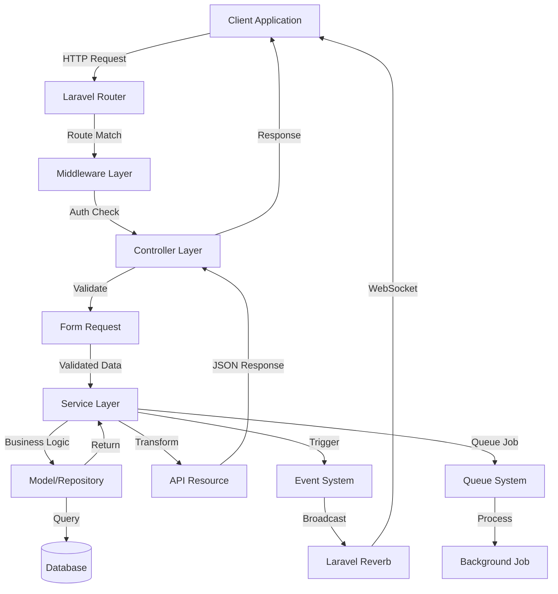
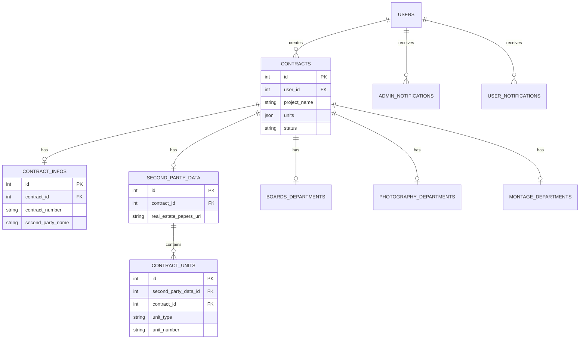
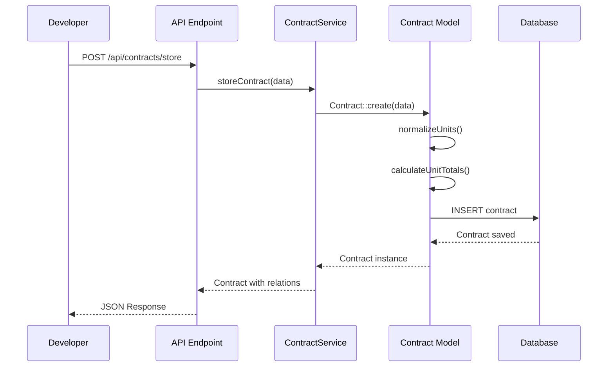
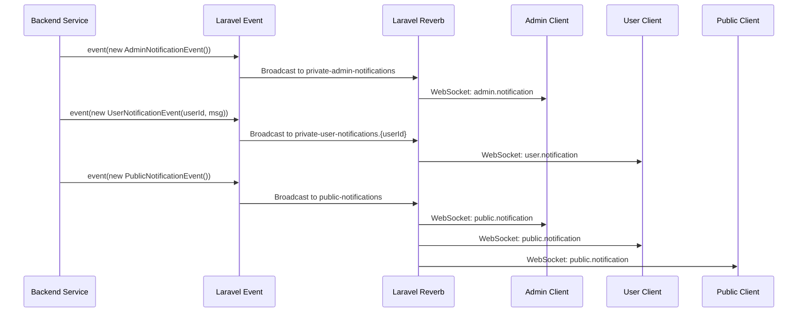

# Rakez ERP System - Comprehensive Codebase Analysis Report

**Generated:** January 2025  
**Project:** Rakez ERP - Real Estate Contract Management System  
**Framework:** Laravel 12.x | PHP 8.2+

---

## Table of Contents

1. [Executive Summary](#1-executive-summary)
2. [Project Idea & Business Domain](#2-project-idea--business-domain)
3. [Architecture & Design Patterns](#3-architecture--design-patterns)
4. [Database Architecture](#4-database-architecture)
5. [Complete API Documentation](#5-complete-api-documentation)
6. [Real-time Features](#6-real-time-features)
7. [Security Features](#7-security-features)
8. [File Structure](#8-file-structure)
9. [Key Features](#9-key-features)
10. [Technology Stack](#10-technology-stack)

---

## 1. Executive Summary

### Project Overview

**Rakez ERP** is a comprehensive Enterprise Resource Planning (ERP) system designed specifically for managing real estate development contracts, units, and multi-department workflows. The system facilitates the complete lifecycle of real estate contracts from initial creation through approval, processing, and completion across multiple specialized departments.

### Technology Stack

- **Backend Framework:** Laravel 12.x
- **Programming Language:** PHP 8.2+
- **Database:** MySQL/MariaDB
- **Authentication:** Laravel Sanctum (API Token Authentication)
- **Real-time Communication:** Laravel Reverb (WebSocket Server)
- **Frontend Assets:** Vite, Tailwind CSS 4.0
- **Queue System:** Laravel Queue (for background job processing)
- **Package Manager:** Composer (PHP), NPM (JavaScript)

### Key Features

- ✅ Contract lifecycle management with status workflow
- ✅ Multi-department workflow (Boards, Photography, Montage)
- ✅ Real-time notifications via WebSocket
- ✅ CSV import for bulk unit management
- ✅ Automatic unit calculations and aggregations
- ✅ Role-based access control (Admin, Project Management, Editor, Developer)
- ✅ Dashboard analytics and statistics
- ✅ Employee management system
- ✅ Soft delete support for data recovery

---

## 2. Project Idea & Business Domain

### Core Purpose

The Rakez ERP system serves as a centralized platform for managing real estate development contracts in Saudi Arabia. It streamlines the process of contract creation, approval, unit management, and multi-department coordination for real estate development projects.

### Business Domain

#### Primary Entities

1. **Contracts** - Main business entity representing real estate development agreements
   - Contains project information (name, developer, location)
   - Manages contract status workflow (pending → approved → ready → completed)
   - Stores unit summaries as JSON arrays
   - Links to contract details and second party information

2. **Contract Units** - Individual units within a contract (apartments, villas, commercial spaces)
   - Detailed unit information (type, number, price, area, status)
   - Supports bulk import via CSV
   - Tracks unit status (pending, sold, reserved, available)

3. **Second Party Data** - Client/customer information and documents
   - Real estate papers, plans, licenses
   - Project logos and marketing materials
   - Links to contract units

4. **Departments** - Specialized workflow departments
   - **Boards Department** - Manages advertising boards
   - **Photography Department** - Handles project photography
   - **Montage Department** - Manages video editing/montage

5. **Users** - System users with different roles
   - **Admin** - Full system access
   - **Project Management** - Contract approval and workflow management
   - **Editor** - Content editing and montage department access
   - **Developer** - Contract creation and management

### Business Workflow

```
Contract Creation (Developer)
    ↓
Contract Approval (Admin)
    ↓
Contract Info Entry (Developer/Admin)
    ↓
Second Party Data Entry (Project Management)
    ↓
Unit CSV Upload (Project Management)
    ↓
Department Processing:
    - Boards Department
    - Photography Department
    - Montage Department (Editor)
    ↓
Status: Ready (Project Management)
    ↓
Status: Completed
```

### Use Cases

1. **Developer** creates a contract with project details and unit summaries
2. **Admin** reviews and approves/rejects contracts
3. **Project Management** adds second party data and uploads detailed unit CSV files
4. **Departments** process contracts through their specialized workflows
5. **All Users** receive real-time notifications about contract status changes
6. **Dashboard** provides analytics on contracts, units, and department performance

---

## 3. Architecture & Design Patterns

### 3.1 Service Layer Pattern

**Purpose:** Separation of business logic from controllers, promoting code reusability and testability.

**Implementation:**
All business logic is encapsulated in service classes located in `app/Services/`. Controllers delegate to services, keeping controllers thin and focused on HTTP concerns.

**Service Classes:**

```php
// Example: ContractService
namespace App\Services\Contract;

class ContractService
{
    public function getContracts(array $filters = [], int $perPage = 15): LengthAwarePaginator
    {
        // Business logic for fetching contracts with filters
    }
    
    public function storeContract(array $data): Contract
    {
        // Business logic for creating contracts
        // Includes authorization, validation, calculations
    }
}
```

**Services Identified:**
- `ContractService` - Contract CRUD and business logic
- `ContractUnitService` - Unit management and CSV processing
- `SecondPartyDataService` - Second party data management
- `BoardsDepartmentService` - Boards department workflow
- `PhotographyDepartmentService` - Photography workflow
- `MontageDepartmentService` - Montage workflow
- `ProjectManagementDashboardService` - Dashboard statistics
- `login.php` / `register.php` - Authentication services

**Benefits:**
- Single Responsibility Principle
- Easy to test business logic independently
- Reusable across different controllers
- Centralized authorization logic

### 3.2 Repository Pattern (Implicit)

**Purpose:** Abstract data access layer using Eloquent ORM with query scopes.

**Implementation:**
Models act as repositories with Eloquent ORM. Query scopes provide reusable query logic.

**Example from Contract Model:**

```php
// Query Scopes
Contract::pending()                    // Get pending contracts
Contract::approved()                   // Get approved contracts
Contract::inCity('الرياض')            // Filter by city
Contract::byDeveloper('Company Name') // Search by developer
Contract::minimumValue(1000000)        // Filter by minimum value
```

**Model Methods:**

```php
// Business logic methods in models
$contract->isApproved()              // Status check
$contract->isOwnedBy($userId)        // Ownership verification
$contract->normalizeUnits()          // Data normalization
$contract->calculateUnitTotals()     // Automatic calculations
```

**Benefits:**
- Clean, readable queries
- Reusable query logic
- Type-safe query building
- Easy to extend with new scopes

### 3.3 Dependency Injection

**Purpose:** Invert dependencies and enable loose coupling between components.

**Implementation:**
Laravel's service container automatically resolves dependencies through constructor injection.

**Example:**

```php
class ContractController extends Controller
{
    protected ContractService $contractService;

    // Service injected via constructor
    public function __construct(ContractService $contractService)
    {
        $this->contractService = $contractService;
    }
    
    public function store(StoreContractRequest $request): JsonResponse
    {
        // Use injected service
        $contract = $this->contractService->storeContract($request->validated());
        return response()->json(['data' => new ContractResource($contract)]);
    }
}
```

**Benefits:**
- Easy to mock services for testing
- Loose coupling between components
- Automatic dependency resolution
- Clear dependencies visible in constructor

### 3.4 Request Validation Pattern

**Purpose:** Centralize validation logic and data normalization.

**Implementation:**
Form Request classes in `app/Http/Requests/` handle validation and normalization.

**Example:**

```php
class StoreContractRequest extends FormRequest
{
    public function rules(): array
    {
        return [
            'project_name' => 'required|string|max:255',
            'units' => 'required|array|min:1',
            'units.*.type' => 'required|string',
            'units.*.count' => 'required|integer|min:1',
            'units.*.price' => 'required|numeric|min:0',
        ];
    }
    
    // Automatic normalization
    protected function prepareForValidation(): void
    {
        $this->normalizeUnits();
    }
}
```

**Request Classes:**
- `StoreContractRequest` - Contract creation validation
- `UpdateContractRequest` - Contract update validation
- `StoreContractInfoRequest` - Contract info validation
- `StoreSecondPartyDataRequest` - Second party data validation
- `UploadContractUnitsRequest` - CSV upload validation
- Department-specific request classes

**Benefits:**
- Centralized validation rules
- Automatic data normalization
- Reusable validation logic
- Clear error messages

### 3.5 Resource Transformation Pattern

**Purpose:** Transform model data for API responses, separating internal data structure from API contract.

**Implementation:**
API Resources in `app/Http/Resources/` transform models into JSON responses.

**Example:**

```php
class ContractResource extends JsonResource
{
    public function toArray($request): array
    {
        return [
            'id' => $this->id,
            'project_name' => $this->project_name,
            'units' => $this->units,
            'units_count' => $this->units_count,
            'total_units_value' => $this->total_units_value,
            'average_unit_price' => $this->average_unit_price,
            'status' => $this->status,
            'user' => new UserResource($this->whenLoaded('user')),
            'info' => new ContractInfoResource($this->whenLoaded('info')),
        ];
    }
}
```

**Resource Classes:**
- `ContractResource` - Full contract details
- `ContractIndexResource` - Contract list view (optimized)
- `ContractInfoResource` - Contract information
- `ContractUnitResource` - Unit details
- `SecondPartyDataResource` - Second party data
- Department-specific resources

**Benefits:**
- Consistent API response format
- Hide internal data structure
- Conditional field inclusion
- Easy to modify API without changing models

### 3.6 Event-Driven Architecture

**Purpose:** Decouple components and enable real-time notifications.

**Implementation:**
Laravel Events with Broadcasting via Laravel Reverb (WebSocket).

**Event Classes:**

```php
// AdminNotificationEvent
class AdminNotificationEvent implements ShouldBroadcastNow
{
    public function broadcastOn(): array
    {
        return [new PrivateChannel('admin-notifications')];
    }
    
    public function broadcastAs(): string
    {
        return 'admin.notification';
    }
}
```

**Events:**
- `AdminNotificationEvent` - Broadcasts to admin users
- `UserNotificationEvent` - Broadcasts to specific user
- `PublicNotificationEvent` - Broadcasts to all users

**Channels:**
- `private-admin-notifications` - Admin-only channel
- `private-user-notifications.{userId}` - User-specific channel
- `public-notifications` - Public channel (no auth required)

**Usage:**

```php
// Trigger event
event(new AdminNotificationEvent('New employee added'));
event(new UserNotificationEvent($userId, 'Your contract was approved'));
event(new PublicNotificationEvent('System maintenance scheduled'));
```

**Benefits:**
- Decoupled components
- Real-time updates
- Scalable notification system
- Easy to add new notification types

### 3.7 Middleware Pattern

**Purpose:** Implement cross-cutting concerns like authentication and authorization.

**Implementation:**
Custom middleware classes handle role-based access control.

**Middleware Classes:**

```php
// AdminMiddleware
class AdminMiddleware
{
    public function handle(Request $request, Closure $next): Response
    {
        if (Auth::user() && Auth::user()->type == "admin") {
            return $next($request);
        }
        return response()->json(['error' => 'you are not Admin'], 401);
    }
}

// ProjectManagementMiddleware
class ProjectManagementMiddleware
{
    public function handle(Request $request, Closure $next): Response
    {
        $user = Auth::user();
        $allowedTypes = ['project_management', 'admin'];
        
        if (!in_array($user->type, $allowedTypes)) {
            return response()->json(['error' => 'Unauthorized'], 403);
        }
        
        return $next($request);
    }
}
```

**Middleware:**
- `AdminMiddleware` - Admin-only access
- `ProjectManagementMiddleware` - Project management + admin access
- `EditorMiddleware` - Editor + admin access
- `auth:sanctum` - Laravel Sanctum authentication

**Benefits:**
- Centralized access control
- Reusable across routes
- Easy to modify authorization logic
- Clear separation of concerns

### 3.8 Observer Pattern (Model Events)

**Purpose:** Automatic calculations and data normalization when models are saved.

**Implementation:**
Model methods handle business logic that executes automatically.

**Example:**

```php
class Contract extends Model
{
    // Automatic calculation on save
    public function calculateUnitTotals(): void
    {
        $this->normalizeUnits();
        
        $unitsCount = 0;
        $totalValue = 0;
        
        foreach ($this->units as $unit) {
            $count = (int) ($unit['count'] ?? 0);
            $price = (float) ($unit['price'] ?? 0);
            $unitsCount += $count;
            $totalValue += ($count * $price);
        }
        
        $this->units_count = $unitsCount;
        $this->total_units_value = $totalValue;
        $this->average_unit_price = $unitsCount > 0 ? ($totalValue / $unitsCount) : 0;
    }
    
    // Data normalization
    public function normalizeUnits(): void
    {
        // Trim whitespace, cast types, remove invalid units
    }
}
```

**Benefits:**
- Automatic data consistency
- No manual calculation needed
- Always up-to-date aggregations
- Clean model API

### Architecture Diagram



---

## 4. Database Architecture

### 4.1 Core Tables

#### Users Table
**Purpose:** User management with role-based access

**Key Fields:**
- `id` - Primary key
- `name` - User full name
- `email` - Email address (unique)
- `password` - Hashed password
- `type` - User role (admin, project_management, editor, developer)
- `phone` - Phone number
- `is_manager` - Manager flag
- `identity_number` - National ID
- `birthday` - Date of birth
- `date_of_works` - Employment start date
- `contract_type` - Employment contract type
- `iban` - Bank account IBAN
- `salary` - Monthly salary
- `marital_status` - Marital status
- `team` - Team assignment
- `deleted_at` - Soft delete timestamp

#### Contracts Table
**Purpose:** Main contract entity

**Key Fields:**
- `id` - Primary key
- `user_id` - Foreign key to users (contract owner)
- `project_name` - Project name
- `developer_name` - Developer company name
- `developer_number` - Developer registration number
- `city` - City location
- `district` - District location
- `units` - JSON array of unit summaries
- `units_count` - Total number of units (calculated)
- `total_units_value` - Total value of all units (calculated)
- `average_unit_price` - Average price per unit (calculated)
- `project_image_url` - Project image URL
- `developer_requiment` - Developer requirements
- `status` - Contract status (pending, approved, rejected, ready, completed)
- `notes` - Additional notes
- `created_at` - Creation timestamp
- `updated_at` - Update timestamp
- `deleted_at` - Soft delete timestamp

#### Contract Infos Table
**Purpose:** Detailed contract information (first and second party)

**Key Fields:**
- `id` - Primary key
- `contract_id` - Foreign key to contracts
- `contract_number` - Auto-generated contract number (ER-{id}-{timestamp})
- `first_party_name` - Company name (fixed: شركة راكز العقارية)
- `first_party_cr_number` - Company registration (fixed: 1010650301)
- `first_party_signatory` - Company signatory (fixed)
- `first_party_phone` - Company phone (fixed)
- `first_party_email` - Company email (fixed)
- `second_party_name` - Client name
- `second_party_id` - Client national ID
- `second_party_phone` - Client phone
- `second_party_email` - Client email
- Additional contract details (dates, commission, agency info, property details)

#### Contract Units Table
**Purpose:** Individual unit details

**Key Fields:**
- `id` - Primary key
- `second_party_data_id` - Foreign key to second_party_data
- `contract_id` - Foreign key to contracts
- `unit_type` - Unit type (شقة, فيلا, etc.)
- `unit_number` - Unit number/identifier
- `status` - Unit status (pending, sold, reserved, available)
- `price` - Unit price
- `area` - Unit area (as string)
- `description` - Unit description

#### Second Party Data Table
**Purpose:** Client documents and information

**Key Fields:**
- `id` - Primary key
- `contract_id` - Foreign key to contracts
- `real_estate_papers_url` - Real estate papers document URL
- `plans_equipment_docs_url` - Plans and equipment documents URL
- `project_logo_url` - Project logo URL
- `prices_units_url` - Prices and units document URL
- `marketing_license_url` - Marketing license URL
- `advertiser_section` - Advertiser section number
- `processed_by` - User ID who processed
- `processed_at` - Processing timestamp

#### Department Tables
**Boards Departments, Photography Departments, Montage Departments**

**Common Fields:**
- `id` - Primary key
- `contract_id` - Foreign key to contracts
- `processed_by` - User ID who processed
- `processed_at` - Processing timestamp
- Department-specific fields

#### Notifications Tables
**Admin Notifications & User Notifications**

**Key Fields:**
- `id` - Primary key
- `user_id` - Foreign key to users (nullable for public notifications)
- `message` - Notification message
- `status` - Notification status (pending, read)
- `created_at` - Creation timestamp

### 4.2 Relationships



### 4.3 Data Flow



---

## 5. Complete API Documentation

### 5.1 Authentication APIs

#### POST `/api/login`
**Description:** User authentication and token generation

**Request Body:**
```json
{
  "email": "user@example.com",
  "password": "password123"
}
```

**Response (200):**
```json
{
  "token": "1|xxxxxxxxxxxx",
  "user": {
    "id": 1,
    "name": "User Name",
    "email": "user@example.com",
    "type": "developer"
  }
}
```

**Authentication:** None (public endpoint)

---

#### POST `/api/logout`
**Description:** Revoke current authentication token

**Headers:**
```
Authorization: Bearer {token}
```

**Response (200):**
```json
{
  "message": "Logged out successfully"
}
```

**Authentication:** Required (auth:sanctum)

---

#### GET `/api/user`
**Description:** Get authenticated user information

**Headers:**
```
Authorization: Bearer {token}
```

**Response (200):**
```json
{
  "id": 1,
  "name": "User Name",
  "email": "user@example.com",
  "type": "developer",
  "phone": "0501234567"
}
```

**Authentication:** Required (auth:sanctum)

---

### 5.2 Contract Management APIs

#### User Endpoints

##### GET `/api/contracts/index`
**Description:** List user's contracts with filtering and pagination

**Headers:**
```
Authorization: Bearer {token}
```

**Query Parameters:**
- `status` (optional) - Filter by status (pending, approved, rejected, ready, completed)
- `city` (optional) - Filter by city
- `district` (optional) - Filter by district
- `project_name` (optional) - Search by project name
- `per_page` (optional, default: 15) - Results per page
- `page` (optional, default: 1) - Page number

**Response (200):**
```json
{
  "success": true,
  "message": "تم جلب العقود بنجاح",
  "data": [
    {
      "id": 1,
      "project_name": "مشروع برج الراكز",
      "developer_name": "شركة التطوير",
      "city": "الرياض",
      "district": "الحمراء",
      "units_count": 10,
      "total_units_value": 6250000,
      "average_unit_price": 625000,
      "status": "pending",
      "created_at": "2025-01-15T10:30:00.000000Z"
    }
  ],
  "meta": {
    "total": 25,
    "count": 15,
    "per_page": 15,
    "current_page": 1,
    "last_page": 2
  }
}
```

**Authentication:** Required (auth:sanctum)

---

##### POST `/api/contracts/store`
**Description:** Create a new contract

**Headers:**
```
Authorization: Bearer {token}
Content-Type: application/json
```

**Request Body:**
```json
{
  "project_name": "مشروع برج الراكز",
  "developer_name": "شركة التطوير السكني",
  "developer_number": "DEV-2025-001",
  "city": "الرياض",
  "district": "الحمراء",
  "developer_requiment": "متطلبات المشروع",
  "project_image_url": "https://example.com/image.jpg",
  "units": [
    {
      "type": "شقة",
      "count": 3,
      "price": 500000
    },
    {
      "type": "فيلا",
      "count": 2,
      "price": 1500000
    }
  ]
}
```

**Response (201):**
```json
{
  "success": true,
  "message": "تم إنشاء العقد بنجاح وحالته قيد الانتظار",
  "data": {
    "id": 1,
    "project_name": "مشروع برج الراكز",
    "units": [...],
    "units_count": 5,
    "total_units_value": 4500000,
    "average_unit_price": 900000,
    "status": "pending"
  }
}
```

**Authentication:** Required (auth:sanctum)  
**Authorization:** User can only create contracts for themselves

---

##### GET `/api/contracts/show/{id}`
**Description:** Get contract details by ID

**Headers:**
```
Authorization: Bearer {token}
```

**Response (200):**
```json
{
  "success": true,
  "message": "تم جلب العقد بنجاح",
  "data": {
    "id": 1,
    "project_name": "مشروع برج الراكز",
    "units": [...],
    "status": "pending",
    "user": {
      "id": 5,
      "name": "أحمد محمد",
      "email": "ahmed@example.com"
    },
    "info": null
  }
}
```

**Authentication:** Required (auth:sanctum)  
**Authorization:** User must own the contract, or be admin/project_management/editor

---

##### PUT `/api/contracts/update/{id}`
**Description:** Update contract (only pending contracts)

**Headers:**
```
Authorization: Bearer {token}
Content-Type: application/json
```

**Request Body:**
```json
{
  "project_name": "مشروع برج الراكز - محدث",
  "units": [
    {
      "type": "شقة",
      "count": 5,
      "price": 550000
    }
  ]
}
```

**Response (200):**
```json
{
  "success": true,
  "message": "تم تحديث العقد بنجاح",
  "data": {
    "id": 1,
    "project_name": "مشروع برج الراكز - محدث",
    "units_count": 5,
    "total_units_value": 2750000,
    "average_unit_price": 550000
  }
}
```

**Authentication:** Required (auth:sanctum)  
**Authorization:** User must own the contract  
**Constraints:** Only pending contracts can be updated

---

##### DELETE `/api/contracts/{id}`
**Description:** Delete contract (soft delete)

**Headers:**
```
Authorization: Bearer {token}
```

**Response (200):**
```json
{
  "success": true,
  "message": "تم حذف العقد بنجاح"
}
```

**Authentication:** Required (auth:sanctum)  
**Authorization:** User must own the contract  
**Constraints:** Only pending contracts can be deleted

---

##### POST `/api/contracts/store/info/{id}`
**Description:** Store contract information (first and second party details)

**Headers:**
```
Authorization: Bearer {token}
Content-Type: application/json
```

**Request Body:**
```json
{
  "second_party_name": "أحمد محمد علي",
  "second_party_id": "1234567890",
  "second_party_phone": "0501234567",
  "second_party_email": "ahmed@example.com"
}
```

**Response (201):**
```json
{
  "success": true,
  "message": "تم حفظ معلومات العقد بنجاح",
  "data": {
    "id": 1,
    "contract_id": 1,
    "contract_number": "ER-1-1703330400",
    "first_party_name": "شركة راكز العقارية",
    "second_party_name": "أحمد محمد علي"
  }
}
```

**Authentication:** Required (auth:sanctum)  
**Authorization:** User must own the contract or be admin  
**Constraints:** Contract must be approved before storing info

---

#### Admin Endpoints

##### GET `/api/admin/contracts/adminIndex`
**Description:** List all contracts (admin view with additional filters)

**Headers:**
```
Authorization: Bearer {token}
```

**Query Parameters:**
- `status` (optional) - Filter by status
- `user_id` (optional) - Filter by user
- `city` (optional) - Filter by city
- `district` (optional) - Filter by district
- `project_name` (optional) - Search by project name
- `has_photography` (optional) - Filter by photography department (0/1)
- `has_montage` (optional) - Filter by montage department (0/1)
- `per_page` (optional, default: 15) - Results per page

**Response (200):**
```json
{
  "success": true,
  "message": "تم جلب العقود بنجاح",
  "data": [...],
  "meta": {...}
}
```

**Authentication:** Required (auth:sanctum)  
**Authorization:** Admin only

---

##### PATCH `/api/admin/contracts/adminUpdateStatus/{id}`
**Description:** Update contract status (admin only)

**Headers:**
```
Authorization: Bearer {token}
Content-Type: application/json
```

**Request Body:**
```json
{
  "status": "approved"
}
```

**Valid Status Values:**
- `pending` - Initial status
- `approved` - Approved by admin
- `rejected` - Rejected by admin
- `completed` - Completed
- `ready` - Ready for processing

**Response (200):**
```json
{
  "success": true,
  "message": "تم تحديث حالة العقد بنجاح",
  "data": {
    "id": 1,
    "status": "approved"
  }
}
```

**Authentication:** Required (auth:sanctum)  
**Authorization:** Admin only  
**Constraints:** Can only update status from pending

---

#### Project Management Endpoints

##### PATCH `/api/contracts/update-status/{id}`
**Description:** Update contract status by project management (ready/rejected)

**Headers:**
```
Authorization: Bearer {token}
Content-Type: application/json
```

**Request Body:**
```json
{
  "status": "ready"
}
```

**Valid Status Values:**
- `ready` - Ready for department processing
- `rejected` - Rejected by project management

**Response (200):**
```json
{
  "success": true,
  "message": "تم تحديث حالة العقد بنجاح",
  "data": {...}
}
```

**Authentication:** Required (auth:sanctum)  
**Authorization:** Project Management or Admin  
**Constraints:** 
- Can only update approved contracts
- For 'ready' status: must have SecondPartyData and CSV units uploaded

---

### 5.3 Second Party Data APIs

**Base Path:** `/api/second-party-data`  
**Authentication:** Required (auth:sanctum)  
**Authorization:** Project Management or Admin

#### GET `/api/second-party-data/show/{id}`
**Description:** Get second party data for a contract

**Response (200):**
```json
{
  "success": true,
  "data": {
    "id": 1,
    "contract_id": 5,
    "real_estate_papers_url": "https://example.com/papers.pdf",
    "plans_equipment_docs_url": "https://example.com/plans.pdf",
    "project_logo_url": "https://example.com/logo.png",
    "prices_units_url": "https://example.com/prices.pdf",
    "marketing_license_url": "https://example.com/license.pdf",
    "advertiser_section": 123,
    "contract_units": [...],
    "processed_by": {
      "id": 3,
      "name": "أحمد محمد",
      "type": "project_management"
    },
    "processed_at": "2025-01-15T12:30:00+00:00"
  }
}
```

---

#### POST `/api/second-party-data/store/{id}`
**Description:** Store second party data for a contract

**Request Body:**
```json
{
  "real_estate_papers_url": "https://example.com/papers.pdf",
  "plans_equipment_docs_url": "https://example.com/plans.pdf",
  "project_logo_url": "https://example.com/logo.png",
  "prices_units_url": "https://example.com/prices.pdf",
  "marketing_license_url": "https://example.com/license.pdf",
  "advertiser_section": 123
}
```

**Response (201):**
```json
{
  "success": true,
  "message": "تم حفظ بيانات الطرف الثاني بنجاح",
  "data": {...}
}
```

**Constraints:**
- Only one record per contract allowed
- Contract must have ContractInfo before storing SecondPartyData

---

#### PUT `/api/second-party-data/update/{id}`
**Description:** Update second party data

**Request Body:**
```json
{
  "real_estate_papers_url": "https://example.com/new-papers.pdf",
  "marketing_license_url": "https://example.com/new-license.pdf"
}
```

**Response (200):**
```json
{
  "success": true,
  "message": "تم تحديث بيانات الطرف الثاني بنجاح",
  "data": {...}
}
```

---

#### GET `/api/second-party-data/second-parties`
**Description:** Get all second parties (unique list)

**Response (200):**
```json
{
  "success": true,
  "data": [
    {
      "name": "أحمد محمد",
      "email": "ahmed@example.com",
      "phone": "0501234567"
    }
  ]
}
```

---

#### GET `/api/second-party-data/contracts-by-email`
**Description:** Get contracts by second party email

**Query Parameters:**
- `email` (required) - Second party email

**Response (200):**
```json
{
  "success": true,
  "data": [
    {
      "id": 1,
      "project_name": "مشروع برج الراكز",
      "contract_number": "ER-1-1703330400"
    }
  ]
}
```

---

### 5.4 Contract Units APIs

**Base Path:** `/api/contracts/units`  
**Authentication:** Required (auth:sanctum)  
**Authorization:** Project Management or Admin

#### GET `/api/contracts/units/show/{contractId}`
**Description:** List units by contract ID

**Query Parameters:**
- `per_page` (optional, default: 15) - Results per page

**Response (200):**
```json
{
  "success": true,
  "data": [
    {
      "id": 1,
      "contract_id": 5,
      "unit_type": "شقة",
      "unit_number": "A101",
      "status": "pending",
      "price": 500000.00,
      "area": "150",
      "description": "شقة غرفتين"
    }
  ],
  "meta": {
    "current_page": 1,
    "last_page": 1,
    "per_page": 15,
    "total": 10
  }
}
```

---

#### POST `/api/contracts/units/upload-csv/{contractId}`
**Description:** Upload CSV file to create contract units

**Headers:**
```
Authorization: Bearer {token}
Content-Type: multipart/form-data
```

**Request Body (form-data):**
```
csv_file: [file.csv]
```

**CSV Format:**
```csv
unit_type,unit_number,count,price,total_price,area,description
شقة,A101,1,500000,500000,150,شقة غرفتين
فيلا,V201,1,1200000,1200000,350,فيلا مستقلة
```

**Response (201):**
```json
{
  "success": true,
  "message": "تم استلام الملف وسيتم معالجته في الخلفية",
  "data": {
    "status": "processing",
    "contract_id": 5,
    "second_party_data_id": 1,
    "units_created": 0
  }
}
```

**Constraints:**
- Only one CSV upload per SecondPartyData allowed
- Processed asynchronously via queue

---

#### POST `/api/contracts/units/store/{contractId}`
**Description:** Create a single contract unit

**Request Body:**
```json
{
  "unit_type": "شقة",
  "unit_number": "A102",
  "status": "pending",
  "price": 550000,
  "area": "160",
  "description": "شقة ثلاث غرف"
}
```

**Response (201):**
```json
{
  "success": true,
  "message": "تم إضافة الوحدة بنجاح",
  "data": {...}
}
```

---

#### PUT `/api/contracts/units/update/{unitId}`
**Description:** Update contract unit

**Request Body:**
```json
{
  "unit_type": "شقة فاخرة",
  "status": "sold",
  "price": 600000,
  "description": "تم البيع"
}
```

**Response (200):**
```json
{
  "success": true,
  "message": "تم تعديل الوحدة بنجاح",
  "data": {...}
}
```

**Valid Status Values:**
- `pending` - معلق
- `sold` - مباع
- `reserved` - محجوز
- `available` - متاح

---

#### DELETE `/api/contracts/units/delete/{unitId}`
**Description:** Delete contract unit

**Response (200):**
```json
{
  "success": true,
  "message": "تم حذف الوحدة بنجاح"
}
```

---

### 5.5 Department APIs

#### Boards Department

**Base Path:** `/api/boards-department`  
**Authentication:** Required (auth:sanctum)  
**Authorization:** Project Management or Admin

##### GET `/api/boards-department/show/{contractId}`
**Description:** Get boards department data for a contract

**Response (200):**
```json
{
  "success": true,
  "data": {
    "id": 1,
    "contract_id": 5,
    "processed_by": {
      "id": 3,
      "name": "أحمد محمد"
    },
    "processed_at": "2025-01-15T12:30:00+00:00"
  }
}
```

---

##### POST `/api/boards-department/store/{contractId}`
**Description:** Store boards department data

**Request Body:**
```json
{
  "field1": "value1",
  "field2": "value2"
}
```

**Response (201):**
```json
{
  "success": true,
  "message": "تم حفظ بيانات قسم اللوحات بنجاح",
  "data": {...}
}
```

---

##### PUT `/api/boards-department/update/{contractId}`
**Description:** Update boards department data

**Request Body:**
```json
{
  "field1": "updated_value"
}
```

**Response (200):**
```json
{
  "success": true,
  "message": "تم تحديث بيانات قسم اللوحات بنجاح",
  "data": {...}
}
```

---

#### Photography Department

**Base Path:** `/api/photography-department`  
**Authentication:** Required (auth:sanctum)  
**Authorization:** Project Management or Admin

##### GET `/api/photography-department/show/{contractId}`
**Description:** Get photography department data

##### POST `/api/photography-department/store/{contractId}`
**Description:** Store photography department data

##### PUT `/api/photography-department/update/{contractId}`
**Description:** Update photography department data

**Same structure as Boards Department**

---

#### Montage Department

**Base Path:** `/api/montage-department` (Editor) or `/api/editor/montage-department`  
**Authentication:** Required (auth:sanctum)  
**Authorization:** Editor or Admin

##### GET `/api/editor/montage-department/show/{contractId}`
**Description:** Get montage department data

##### POST `/api/editor/montage-department/store/{contractId}`
**Description:** Store montage department data

##### PUT `/api/editor/montage-department/update/{contractId}`
**Description:** Update montage department data

**Same structure as other departments**

---

### 5.6 Notification APIs

#### Admin Notification APIs

**Base Path:** `/api/admin/notifications`  
**Authentication:** Required (auth:sanctum)  
**Authorization:** Admin only

##### GET `/api/admin/notifications`
**Description:** Get admin's notifications

**Response (200):**
```json
{
  "data": [
    {
      "id": 1,
      "message": "New employee added with ID: 5",
      "status": "pending",
      "created_at": "2025-01-15T10:30:00.000000Z"
    }
  ],
  "count": 5
}
```

---

##### POST `/api/admin/notifications/send-to-user`
**Description:** Send notification to specific user

**Request Body:**
```json
{
  "user_id": 5,
  "message": "Your contract was approved"
}
```

**Response (201):**
```json
{
  "message": "Notification sent to user",
  "data": {...}
}
```

**Real-time:** Broadcasts via `UserNotificationEvent`

---

##### POST `/api/admin/notifications/send-public`
**Description:** Send public notification to all users

**Request Body:**
```json
{
  "message": "System maintenance scheduled for tonight"
}
```

**Response (201):**
```json
{
  "message": "Public notification sent",
  "data": {...}
}
```

**Real-time:** Broadcasts via `PublicNotificationEvent`

---

##### GET `/api/admin/notifications/user/{userId}`
**Description:** Get all notifications of specific user (admin view)

**Response (200):**
```json
{
  "data": [...],
  "count": 10
}
```

---

##### GET `/api/admin/notifications/public`
**Description:** Get all public notifications (admin view)

**Response (200):**
```json
{
  "data": [...],
  "count": 5
}
```

---

#### User Notification APIs

**Base Path:** `/api/user/notifications`  
**Authentication:** Required (auth:sanctum)

##### GET `/api/user/notifications/private`
**Description:** Get user's private notifications

**Response (200):**
```json
{
  "data": [
    {
      "id": 1,
      "message": "Your contract was approved",
      "status": "pending",
      "created_at": "2025-01-15T10:30:00.000000Z"
    }
  ],
  "count": 3
}
```

---

##### GET `/api/user/notifications/public`
**Description:** Get public notifications

**Response (200):**
```json
{
  "data": [
    {
      "id": 1,
      "message": "System maintenance scheduled",
      "status": "pending",
      "created_at": "2025-01-15T10:30:00.000000Z"
    }
  ],
  "count": 5
}
```

---

##### PATCH `/api/user/notifications/mark-all-read`
**Description:** Mark all user notifications as read

**Response (200):**
```json
{
  "message": "All notifications marked as read"
}
```

---

##### PATCH `/api/user/notifications/{id}/read`
**Description:** Mark specific notification as read

**Response (200):**
```json
{
  "message": "Notification marked as read"
}
```

---

### 5.7 Dashboard APIs

**Base Path:** `/api/project_management/dashboard`  
**Authentication:** Required (auth:sanctum)  
**Authorization:** Project Management or Admin

#### GET `/api/project_management/dashboard/`
**Description:** Get dashboard statistics

**Response (200):**
```json
{
  "success": true,
  "message": "تم جلب إحصائيات لوحة التحكم بنجاح",
  "data": {
    "total_contracts": 150,
    "pending_contracts": 25,
    "approved_contracts": 50,
    "ready_contracts": 30,
    "completed_contracts": 45,
    "total_units": 500,
    "total_value": 250000000
  }
}
```

---

#### GET `/api/project_management/dashboard/units-statistics`
**Description:** Get units statistics

**Response (200):**
```json
{
  "success": true,
  "message": "تم جلب إحصائيات الوحدات بنجاح",
  "data": {
    "total_units": 500,
    "by_status": {
      "pending": 200,
      "sold": 150,
      "reserved": 100,
      "available": 50
    },
    "by_type": {
      "شقة": 300,
      "فيلا": 150,
      "محل تجاري": 50
    },
    "total_value": 250000000,
    "average_price": 500000
  }
}
```

---

### 5.8 Employee Management APIs (Admin)

**Base Path:** `/api/admin/employees`  
**Authentication:** Required (auth:sanctum)  
**Authorization:** Admin only

#### POST `/api/admin/employees/add_employee`
**Description:** Add new employee

**Request Body:**
```json
{
  "name": "أحمد محمد",
  "email": "ahmed@example.com",
  "password": "password123",
  "type": "project_management",
  "phone": "0501234567",
  "is_manager": false,
  "identity_number": "1234567890",
  "birthday": "1990-01-01",
  "date_of_works": "2024-01-01",
  "contract_type": "full_time",
  "iban": "SA1234567890123456789012",
  "salary": 10000,
  "marital_status": "single",
  "team": "Development"
}
```

**Response (201):**
```json
{
  "success": true,
  "message": "تم إضافة الموظف بنجاح",
  "data": {
    "id": 10,
    "name": "أحمد محمد",
    "email": "ahmed@example.com",
    "type": "project_management"
  }
}
```

**Real-time:** Triggers `AdminNotificationEvent` to notify all admins

---

#### GET `/api/admin/employees/list_employees`
**Description:** List all employees

**Query Parameters:**
- `per_page` (optional, default: 15) - Results per page
- `type` (optional) - Filter by user type
- `is_manager` (optional) - Filter by manager status

**Response (200):**
```json
{
  "success": true,
  "data": [
    {
      "id": 1,
      "name": "أحمد محمد",
      "email": "ahmed@example.com",
      "type": "project_management",
      "phone": "0501234567",
      "is_manager": false
    }
  ],
  "meta": {
    "total": 50,
    "per_page": 15,
    "current_page": 1
  }
}
```

---

#### GET `/api/admin/employees/show_employee/{id}`
**Description:** Get employee details

**Response (200):**
```json
{
  "success": true,
  "data": {
    "id": 1,
    "name": "أحمد محمد",
    "email": "ahmed@example.com",
    "type": "project_management",
    "phone": "0501234567",
    "identity_number": "1234567890",
    "birthday": "1990-01-01",
    "date_of_works": "2024-01-01",
    "contract_type": "full_time",
    "iban": "SA1234567890123456789012",
    "salary": 10000.00,
    "marital_status": "single",
    "team": "Development",
    "is_manager": false,
    "created_at": "2024-01-01T10:00:00.000000Z"
  }
}
```

---

#### PUT `/api/admin/employees/update_employee/{id}`
**Description:** Update employee information

**Request Body:**
```json
{
  "name": "أحمد محمد علي",
  "phone": "0509876543",
  "salary": 12000,
  "is_manager": true
}
```

**Response (200):**
```json
{
  "success": true,
  "message": "تم تحديث الموظف بنجاح",
  "data": {...}
}
```

---

#### DELETE `/api/admin/employees/delete_employee/{id}`
**Description:** Delete employee (soft delete)

**Response (200):**
```json
{
  "success": true,
  "message": "تم حذف الموظف بنجاح"
}
```

---

#### PATCH `/api/admin/employees/restore/{id}`
**Description:** Restore soft-deleted employee

**Response (200):**
```json
{
  "success": true,
  "message": "تم استعادة الموظف بنجاح",
  "data": {...}
}
```

---

### 5.9 API Endpoint Summary Table

| Method | Endpoint | Auth | Authorization | Description |
|--------|----------|------|---------------|-------------|
| POST | `/api/login` | None | Public | User login |
| POST | `/api/logout` | Required | User | User logout |
| GET | `/api/user` | Required | User | Get authenticated user |
| GET | `/api/contracts/index` | Required | User | List user contracts |
| POST | `/api/contracts/store` | Required | User | Create contract |
| GET | `/api/contracts/show/{id}` | Required | Owner/Admin/PM/Editor | Get contract |
| PUT | `/api/contracts/update/{id}` | Required | Owner | Update contract |
| DELETE | `/api/contracts/{id}` | Required | Owner | Delete contract |
| POST | `/api/contracts/store/info/{id}` | Required | Owner/Admin | Store contract info |
| GET | `/api/admin/contracts/adminIndex` | Required | Admin | List all contracts |
| PATCH | `/api/admin/contracts/adminUpdateStatus/{id}` | Required | Admin | Update status |
| PATCH | `/api/contracts/update-status/{id}` | Required | PM/Admin | Update status (PM) |
| GET | `/api/second-party-data/show/{id}` | Required | PM/Admin | Get second party data |
| POST | `/api/second-party-data/store/{id}` | Required | PM/Admin | Store second party data |
| PUT | `/api/second-party-data/update/{id}` | Required | PM/Admin | Update second party data |
| GET | `/api/contracts/units/show/{contractId}` | Required | PM/Admin | List units |
| POST | `/api/contracts/units/upload-csv/{contractId}` | Required | PM/Admin | Upload CSV |
| POST | `/api/contracts/units/store/{contractId}` | Required | PM/Admin | Create unit |
| PUT | `/api/contracts/units/update/{unitId}` | Required | PM/Admin | Update unit |
| DELETE | `/api/contracts/units/delete/{unitId}` | Required | PM/Admin | Delete unit |
| GET | `/api/boards-department/show/{contractId}` | Required | PM/Admin | Get boards data |
| POST | `/api/boards-department/store/{contractId}` | Required | PM/Admin | Store boards data |
| PUT | `/api/boards-department/update/{contractId}` | Required | PM/Admin | Update boards data |
| GET | `/api/photography-department/show/{contractId}` | Required | PM/Admin | Get photography data |
| POST | `/api/photography-department/store/{contractId}` | Required | PM/Admin | Store photography data |
| PUT | `/api/photography-department/update/{contractId}` | Required | PM/Admin | Update photography data |
| GET | `/api/editor/montage-department/show/{contractId}` | Required | Editor/Admin | Get montage data |
| POST | `/api/editor/montage-department/store/{contractId}` | Required | Editor/Admin | Store montage data |
| PUT | `/api/editor/montage-department/update/{contractId}` | Required | Editor/Admin | Update montage data |
| GET | `/api/admin/notifications` | Required | Admin | Get admin notifications |
| POST | `/api/admin/notifications/send-to-user` | Required | Admin | Send to user |
| POST | `/api/admin/notifications/send-public` | Required | Admin | Send public |
| GET | `/api/user/notifications/private` | Required | User | Get private notifications |
| GET | `/api/user/notifications/public` | Required | User | Get public notifications |
| PATCH | `/api/user/notifications/mark-all-read` | Required | User | Mark all read |
| PATCH | `/api/user/notifications/{id}/read` | Required | User | Mark as read |
| GET | `/api/project_management/dashboard/` | Required | PM/Admin | Dashboard stats |
| GET | `/api/project_management/dashboard/units-statistics` | Required | PM/Admin | Units stats |
| POST | `/api/admin/employees/add_employee` | Required | Admin | Add employee |
| GET | `/api/admin/employees/list_employees` | Required | Admin | List employees |
| GET | `/api/admin/employees/show_employee/{id}` | Required | Admin | Show employee |
| PUT | `/api/admin/employees/update_employee/{id}` | Required | Admin | Update employee |
| DELETE | `/api/admin/employees/delete_employee/{id}` | Required | Admin | Delete employee |
| PATCH | `/api/admin/employees/restore/{id}` | Required | Admin | Restore employee |

**Legend:**
- **Auth:** Authentication requirement
- **Authorization:** Required user role/access level
- **PM:** Project Management
- **Owner:** Contract owner

---

## 6. Real-time Features

### 6.1 WebSocket Architecture

The system uses **Laravel Reverb** for real-time WebSocket communication, enabling instant notifications without polling.

### 6.2 Broadcasting Channels

#### Private Channels (Authentication Required)

1. **Admin Notifications Channel**
   - Channel: `private-admin-notifications`
   - Event: `admin.notification`
   - Access: Admin users only
   - Usage: Notify all admins about system events

2. **User Notifications Channel**
   - Channel: `private-user-notifications.{userId}`
   - Event: `user.notification`
   - Access: Specific user only
   - Usage: Notify individual users about their contracts

#### Public Channel (No Authentication)

3. **Public Notifications Channel**
   - Channel: `public-notifications`
   - Event: `public.notification`
   - Access: Everyone (no auth required)
   - Usage: Broadcast announcements to all users

### 6.3 Event Broadcasting Flow



### 6.4 Frontend Integration

**JavaScript Setup:**

```javascript
// Initialize Pusher client
const pusher = new Pusher(REVERB_APP_KEY, {
    wsHost: REVERB_HOST,
    wsPort: REVERB_PORT,
    forceTLS: false,
    enabledTransports: ['ws', 'wss'],
    cluster: 'mt1',
    authEndpoint: '/api/broadcasting/auth',
    auth: {
        headers: { 'Authorization': 'Bearer ' + userToken }
    }
});

// Subscribe to admin channel
const adminChannel = pusher.subscribe('private-admin-notifications');
adminChannel.bind('admin.notification', function(data) {
    console.log('Admin notification:', data.message);
    // Display notification to admin
});

// Subscribe to user channel
const userId = 123;
const userChannel = pusher.subscribe('private-user-notifications.' + userId);
userChannel.bind('user.notification', function(data) {
    console.log('User notification:', data.message);
    // Display notification to user
});

// Subscribe to public channel (no auth needed)
const publicChannel = pusher.subscribe('public-notifications');
publicChannel.bind('public.notification', function(data) {
    console.log('Public notification:', data.message);
    // Display notification to everyone
});
```

### 6.5 Real-time Use Cases

1. **Employee Added Notification**
   - When admin adds employee → `AdminNotificationEvent` → All admins notified instantly

2. **Contract Status Changed**
   - When contract status changes → `UserNotificationEvent` → Contract owner notified instantly

3. **System Announcements**
   - When admin sends public notification → `PublicNotificationEvent` → All users notified instantly

### 6.6 Configuration

**Environment Variables:**
```env
REVERB_APP_ID=your-app-id
REVERB_APP_KEY=your-app-key
REVERB_APP_SECRET=your-app-secret
REVERB_HOST=127.0.0.1
REVERB_PORT=8080
REVERB_SCHEME=http
```

**Running Reverb:**
```bash
php artisan reverb:start
```

---

## 7. Security Features

### 7.1 Authentication

**Laravel Sanctum** provides API token authentication:

- Token-based authentication for API requests
- Tokens stored in `personal_access_tokens` table
- Token expiration and revocation support
- Secure token generation

**Implementation:**
```php
// Login generates token
$token = $user->createToken('api-token')->plainTextToken;

// Requests include token in header
Authorization: Bearer {token}
```

### 7.2 Authorization

**Role-Based Access Control (RBAC):**

1. **Middleware Protection**
   - `AdminMiddleware` - Admin only
   - `ProjectManagementMiddleware` - PM + Admin
   - `EditorMiddleware` - Editor + Admin

2. **Service Layer Authorization**
   - `authorizeContractAccess()` method checks ownership and roles
   - Prevents unauthorized access to contracts

3. **Route-Level Protection**
   - Routes grouped by middleware
   - Different endpoints for different roles

### 7.3 Input Validation

**Form Request Validation:**
- All inputs validated via Form Request classes
- Type casting and normalization
- SQL injection prevention via `addslashes()` on search inputs
- XSS prevention through Laravel's built-in escaping

### 7.4 Data Protection

1. **Soft Deletes**
   - Contracts use soft deletes for data recovery
   - `deleted_at` timestamp instead of permanent deletion

2. **Protected Fields**
   - First party contract details cannot be overridden
   - Status changes restricted by role and current status

3. **Ownership Verification**
   - Users can only access/modify their own contracts
   - Admins and PM can access all contracts

### 7.5 Security Best Practices

- ✅ Password hashing via Laravel's `Hash` facade
- ✅ CSRF protection for web routes
- ✅ SQL injection prevention
- ✅ XSS prevention
- ✅ Authorization checks at multiple layers
- ✅ Input sanitization and validation
- ✅ Secure file upload handling
- ✅ Token-based authentication
- ✅ Role-based access control

---

## 8. File Structure

### 8.1 Directory Organization

```
rakez-erp/
├── app/
│   ├── Events/                    # Laravel Events
│   │   ├── AdminNotificationEvent.php
│   │   ├── PublicNotificationEvent.php
│   │   └── UserNotificationEvent.php
│   ├── Helpers/                   # Helper classes
│   │   └── OtpHelper.php
│   ├── Http/
│   │   ├── Controllers/           # Controllers organized by feature
│   │   │   ├── Contract/
│   │   │   │   ├── ContractController.php
│   │   │   │   ├── ContractInfoController.php
│   │   │   │   ├── ContractUnitController.php
│   │   │   │   ├── SecondPartyDataController.php
│   │   │   │   ├── BoardsDepartmentController.php
│   │   │   │   ├── PhotographyDepartmentController.php
│   │   │   │   └── MontageDepartmentController.php
│   │   │   ├── Dashboard/
│   │   │   │   └── ProjectManagementDashboardController.php
│   │   │   ├── Registration/
│   │   │   │   ├── LoginController.php
│   │   │   │   ├── RegisterController.php
│   │   │   │   ├── GoogleAuthController.php
│   │   │   │   └── FacebookController.php
│   │   │   └── NotificationController.php
│   │   ├── Middleware/            # Custom middleware
│   │   │   ├── AdminMiddleware.php
│   │   │   ├── ProjectManagementMiddleware.php
│   │   │   └── EditorMiddleware.php
│   │   ├── Requests/              # Form Request validation
│   │   │   └── Contract/
│   │   │       ├── StoreContractRequest.php
│   │   │       ├── UpdateContractRequest.php
│   │   │       └── ...
│   │   └── Resources/             # API Resources
│   │       └── Contract/
│   │           ├── ContractResource.php
│   │           ├── ContractIndexResource.php
│   │           └── ...
│   ├── Jobs/                      # Queue jobs
│   │   └── ProcessContractUnitsCsv.php
│   ├── Mail/                      # Email classes
│   │   ├── ResetPasswordMail.php
│   │   └── SendOtpMail.php
│   ├── Models/                    # Eloquent models
│   │   ├── User.php
│   │   ├── Contract.php
│   │   ├── ContractInfo.php
│   │   ├── ContractUnit.php
│   │   ├── SecondPartyData.php
│   │   ├── BoardsDepartment.php
│   │   ├── PhotographyDepartment.php
│   │   ├── MontageDepartment.php
│   │   ├── AdminNotification.php
│   │   └── UserNotification.php
│   ├── Notifications/             # Laravel Notifications
│   ├── Providers/                # Service providers
│   └── Services/                  # Business logic services
│       ├── Contract/
│       │   ├── ContractService.php
│       │   ├── ContractUnitService.php
│       │   ├── SecondPartyDataService.php
│       │   ├── BoardsDepartmentService.php
│       │   ├── PhotographyDepartmentService.php
│       │   └── MontageDepartmentService.php
│       ├── Dashboard/
│       │   └── ProjectManagementDashboardService.php
│       └── registartion/
│           ├── login.php
│           └── register.php
├── config/                        # Configuration files
├── database/
│   ├── migrations/               # Database migrations
│   └── seeders/                  # Database seeders
├── routes/
│   ├── api.php                   # API routes
│   ├── channels.php              # Broadcasting channels
│   └── web.php                   # Web routes
├── resources/
│   ├── css/                      # Stylesheets
│   ├── js/                       # JavaScript
│   └── views/                    # Blade templates
├── tests/                        # Test files
├── public/                       # Public assets
└── storage/                      # Storage directory
```

### 8.2 Key File Patterns

**Controller Pattern:**
```php
class ContractController extends Controller
{
    protected ContractService $contractService;
    
    public function __construct(ContractService $contractService)
    {
        $this->contractService = $contractService;
    }
    
    public function store(StoreContractRequest $request): JsonResponse
    {
        // Delegate to service
        $contract = $this->contractService->storeContract($request->validated());
        return response()->json(['data' => new ContractResource($contract)]);
    }
}
```

**Service Pattern:**
```php
class ContractService
{
    public function storeContract(array $data): Contract
    {
        DB::beginTransaction();
        try {
            // Business logic
            $contract = Contract::create($data);
            $contract->calculateUnitTotals();
            $contract->save();
            DB::commit();
            return $contract;
        } catch (Exception $e) {
            DB::rollBack();
            throw $e;
        }
    }
}
```

**Model Pattern:**
```php
class Contract extends Model
{
    use SoftDeletes;
    
    protected $casts = [
        'units' => 'array',
    ];
    
    public function calculateUnitTotals(): void
    {
        // Automatic calculations
    }
    
    public function scopePending($query)
    {
        return $query->where('status', 'pending');
    }
}
```

---

## 9. Key Features

### 9.1 Automatic Unit Calculations

When contracts are created or updated with unit arrays, the system automatically calculates:
- **units_count** - Total number of units
- **total_units_value** - Total value of all units
- **average_unit_price** - Average price per unit

**Example:**
```json
{
  "units": [
    {"type": "شقة", "count": 3, "price": 500000},
    {"type": "فيلا", "count": 2, "price": 1500000}
  ]
}
```

**Calculated:**
- `units_count = 5`
- `total_units_value = 4,500,000`
- `average_unit_price = 900,000`

### 9.2 CSV Import for Contract Units

- Bulk import units via CSV file
- Supports Arabic and English column names
- Processed asynchronously via queue
- One CSV per SecondPartyData record

### 9.3 Multi-Department Workflow

Three specialized departments process contracts:
1. **Boards Department** - Advertising boards management
2. **Photography Department** - Project photography
3. **Montage Department** - Video editing/montage

Each department can:
- View contract details
- Add department-specific data
- Track processing status
- Record who processed and when

### 9.4 Real-time Notifications

- Instant notifications via WebSocket
- Three notification types:
  - Admin notifications (admin-only channel)
  - User notifications (user-specific channel)
  - Public notifications (broadcast to all)

### 9.5 Dashboard Analytics

- Contract statistics (total, by status)
- Unit statistics (total, by status, by type)
- Value aggregations
- Performance metrics

### 9.6 Status Workflow Management

Contract statuses flow through:
```
pending → approved → ready → completed
         ↓
      rejected
```

- **pending** - Initial status, can be edited/deleted
- **approved** - Approved by admin, can add contract info
- **ready** - Ready for department processing (requires SecondPartyData + CSV)
- **completed** - Contract completed
- **rejected** - Rejected by admin or PM

### 9.7 Soft Deletes

- Contracts use soft deletes
- Data recovery possible
- `deleted_at` timestamp tracking

### 9.8 Employee Management

- Full CRUD operations for employees
- Role assignment
- Employee profile management
- Soft delete with restore capability
- Real-time admin notifications on employee addition

---

## 10. Technology Stack

### 10.1 Backend

- **Framework:** Laravel 12.x
- **Language:** PHP 8.2+
- **Database:** MySQL/MariaDB
- **ORM:** Eloquent ORM
- **Authentication:** Laravel Sanctum
- **Real-time:** Laravel Reverb (WebSocket)
- **Queue:** Laravel Queue
- **Validation:** Laravel Form Requests
- **API Resources:** Laravel API Resources

### 10.2 Frontend Assets

- **Build Tool:** Vite 7.x
- **CSS Framework:** Tailwind CSS 4.0
- **JavaScript Libraries:**
  - Laravel Echo (WebSocket client)
  - Pusher JS (WebSocket protocol)
  - Axios (HTTP client)

### 10.3 Development Tools

- **Package Manager:** Composer (PHP), NPM (JavaScript)
- **Code Style:** Laravel Pint
- **Testing:** PHPUnit
- **Logging:** Laravel Pail

### 10.4 Dependencies

**PHP Packages:**
```json
{
  "laravel/framework": "^12.0",
  "laravel/reverb": "^1.6",
  "laravel/sanctum": "^4.2",
  "laravel/tinker": "^2.10.1"
}
```

**JavaScript Packages:**
```json
{
  "laravel-echo": "^2.2.7",
  "pusher-js": "^8.4.0",
  "axios": "^1.11.0"
}
```

### 10.5 Server Requirements

- PHP 8.2+
- Composer
- Node.js 20+
- MySQL/MariaDB
- WebSocket server (for Reverb)

---

## Conclusion

The Rakez ERP system is a well-architected Laravel application that demonstrates:

- ✅ **Clean Architecture** - Service layer pattern, separation of concerns
- ✅ **Design Patterns** - Repository, Dependency Injection, Event-Driven Architecture
- ✅ **Security** - Role-based access control, input validation, authentication
- ✅ **Real-time Features** - WebSocket notifications
- ✅ **Scalability** - Queue system for background processing
- ✅ **Maintainability** - Well-organized code structure, clear naming conventions
- ✅ **API Design** - RESTful APIs with proper resources and validation

The system effectively manages the complete lifecycle of real estate contracts with multi-department workflows, real-time notifications, and comprehensive analytics.

---

**Report Generated:** January 2025  
**Version:** 1.0  
**Framework:** Laravel 12.x
