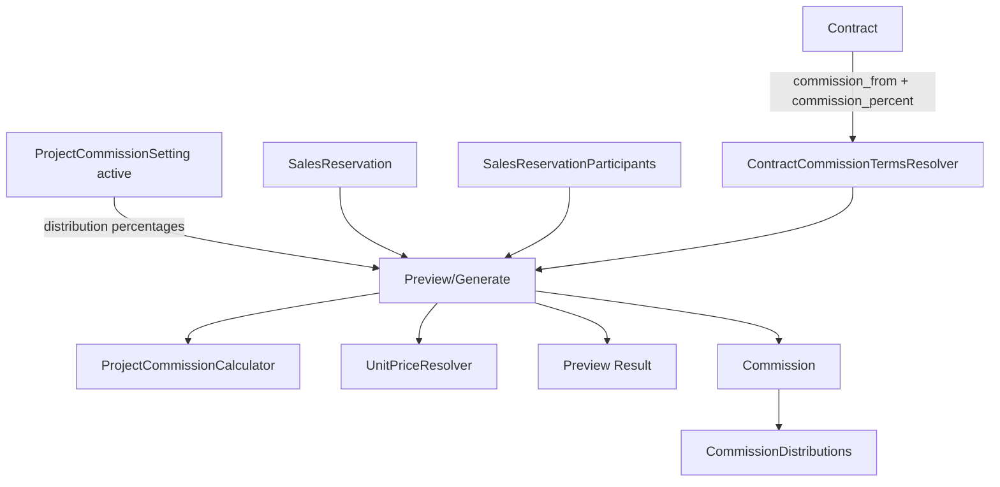
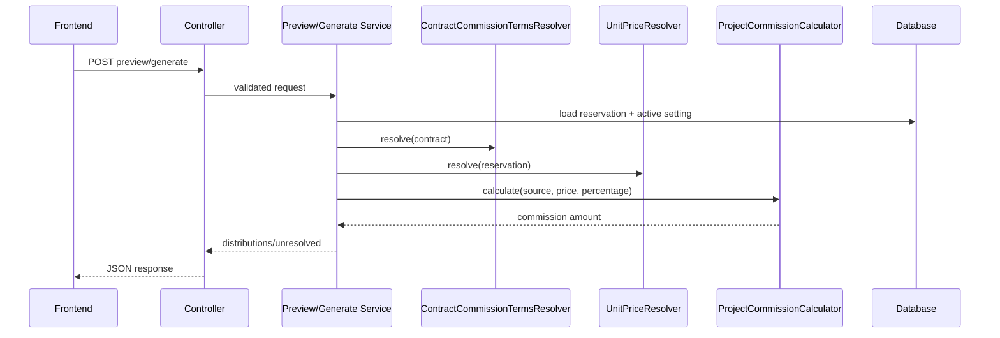
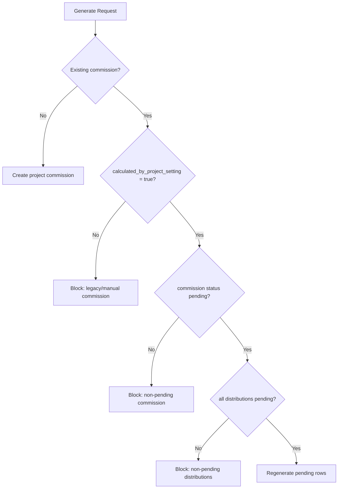
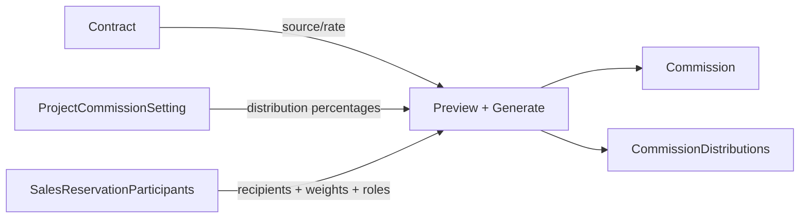

# تقرير العمولات وربط نسبة ومصدر العمولة بالعقد — RAKEZ ERP

## 1. الملخص التنفيذي

- تم فحص مسار عمولات المشاريع بالكامل من `Contract` حتى المعاينة والتوليد والتوزيع والراوتات والاختبارات.
- النتيجة المؤكدة: مصدر العمولة ونسبتها للـ project-based commissions تأتي من **العقد** عبر الحقول:
  - `contracts.commission_from`
  - `contracts.commission_percent`
- `project_commission_settings` لا يجب اعتباره مصدر الحقيقة لمصدر/نسبة العمولة. دوره الحالي الفعلي هو:
  - تخزين **snapshot** متزامن من العقد لأغراض التوافق/العرض
  - تخزين نسب التوزيع فقط
- المعاينة والتوليد يعتمدان فعليًا على:
  1. مصدر العمولة من العقد
  2. نسبة العمولة من العقد
  3. نسب التوزيع من الـ active `ProjectCommissionSetting`
  4. المشاركين من `SalesReservationParticipant`
- الاختبارات المطلوبة شُغلت ونجحت: `71 passed`.

## 2. نتيجة الفحص

| بند الفحص | النتيجة |
|---|---|
| هل مصدر العمولة يأتي من العقد؟ | نعم |
| هل نسبة العمولة تأتي من العقد؟ | نعم |
| هل يوجد `ContractCommissionTermsResolver`؟ | نعم |
| هل preview/generate يستخدمان الـ resolver؟ | نعم |
| هل create/update للـ setting يطلبان source/rate؟ | لا |
| هل create/update يثقان بقيم source/rate من الطلب؟ | لا |
| هل ما زالت أعمدة source/rate موجودة في setting؟ | نعم، كـ snapshot/backward compatibility |
| هل generate يقبل source/rate/custom percentages؟ | لا، الطلب فارغ |
| هل العمولات اليدوية/القديمة محمية من overwrite؟ | نعم |
| هل `source_scope` و `source_type` هما canonical؟ | نعم للـ project-generated rows |
| هل `commission_distributions.type` ما زال legacy؟ | نعم |

## 3. مصدر الحقيقة للعمولة

### المصدر canonical

- الموديل: [app/Models/Contract.php](/c:/Users/Yusuf/OneDrive/Desktop/Rakez/rakez-erp/app/Models/Contract.php)
- الحقول:
  - `commission_from`
  - `commission_percent`

### طبقة الحل

- الخدمة: [app/Services/Accounting/ContractCommissionTermsResolver.php](/c:/Users/Yusuf/OneDrive/Desktop/Rakez/rakez-erp/app/Services/Accounting/ContractCommissionTermsResolver.php)
- السلوك:
  - تقرأ `commission_from`
  - تطبعها إلى `buyer` أو `owner`
  - تقرأ `commission_percent`
  - ترفض القيم الفارغة أو `<= 0`

### التطبيع الحالي

- `buyer` إذا كانت القيمة `buyer` أو نص عربي يحتوي `المشتري`
- `owner` إذا كانت القيمة `owner` أو نص عربي يحتوي `المالك`

## 4. ما الذي يدخله الأدمن

الأدمن/المحاسبة عند إنشاء أو تعديل `ProjectCommissionSetting` يدخل فقط:

- `project_id`
- نسب التوزيع:
  - `assigned_bring_percentage`
  - `assigned_convince_percentage`
  - `assigned_close_percentage`
  - `outside_bring_percentage`
  - `outside_convince_percentage`
  - `outside_close_percentage`
- نسب الإدارة والمستخدمين المرتبطين بها:
  - `ceo_user_id` + `ceo_percentage`
  - `sales_manager_user_id` + `sales_manager_percentage`
  - `sales_leader_user_id` + `sales_leader_percentage`
  - `group_leader_user_id` + `group_leader_percentage`
  - `external_marketer_user_id` + `external_marketer_percentage`
- `is_active`

## 5. ما الذي لا يدخله الأدمن

- لا يُفترض أن يدخل:
  - `commission_source`
  - `commission_percentage`
- السبب:
  - `StoreProjectCommissionSettingRequest` و `UpdateProjectCommissionSettingRequest` لا يضعان لهذين الحقلين rules
  - `validated()` لا يمررهما
  - `ProjectCommissionSettingService` يعيد ملأهما من العقد
  - `update()` يحذفهما صراحة من payload قبل الحفظ

ملاحظة مهمة:

- بما أن الجدول ما زال يحتوي الأعمدة، فهي موجودة اليوم كـ **snapshot متزامن** لا كـ source of truth.

## 6. بنية الجداول

### contracts

- المصدر الفعلي:
  - `commission_from`
  - `commission_percent`

### project_commission_settings

- من [database/migrations/2026_05_06_100000_create_project_commission_settings_table.php](/c:/Users/Yusuf/OneDrive/Desktop/Rakez/rakez-erp/database/migrations/2026_05_06_100000_create_project_commission_settings_table.php)
- يحتوي:
  - `commission_source`
  - `commission_percentage`
  - جميع نسب التوزيع
  - `is_active`
  - `created_by`

حكم التدقيق:

- وجود `commission_source` و `commission_percentage` هنا لا يغيّر الحقيقة الوظيفية الحالية.
- الاستخدام الصحيح الحالي: snapshot/backward compatibility فقط.

### commissions

- من [app/Models/Commission.php](/c:/Users/Yusuf/OneDrive/Desktop/Rakez/rakez-erp/app/Models/Commission.php)
- أعمدة Stage 4:
  - `project_commission_setting_id`
  - `calculation_formula_key`
  - `calculated_by_project_setting`

### commission_distributions

- canonical الجديد:
  - `source_scope`
  - `source_type`
- legacy compatibility:
  - `type`

## 7. العلاقات بين الموديلات

- `Contract -> hasMany(ProjectCommissionSetting)`
- `Contract -> hasOne(activeProjectCommissionSetting)`
- `Contract -> hasMany(SalesReservation)`
- `SalesReservation -> belongsTo(Contract)`
- `SalesReservation -> belongsTo(ContractUnit)`
- `SalesReservation -> hasMany(participantRecords)`
- `SalesReservation -> hasOne(Commission)`
- `Commission -> belongsTo(ProjectCommissionSetting)`
- `Commission -> hasMany(CommissionDistribution)`
- `CommissionDistribution -> belongsTo(Commission)`
- `SalesReservationParticipant -> belongsTo(User)`

## 8. معادلات العمولة

الخدمة: [app/Services/Accounting/ProjectCommissionCalculator.php](/c:/Users/Yusuf/OneDrive/Desktop/Rakez/rakez-erp/app/Services/Accounting/ProjectCommissionCalculator.php)

### buyer

```text
commission_amount = unit_price * commission_percentage / 100
```

- `formula_key = buyer_unit_price_times_rate`

### owner

```text
commission_amount = unit_price / (1 + commission_percentage / 100)
```

- `formula_key = owner_unit_price_divided_by_100_percent_plus_rate`
- النتيجة هنا هي **قيمة العمولة نفسها**
- لا يتم طرحها من `unit_price`

## 9. فلو المعاينة

### Project preview

1. يستقبل `base_amount`
2. يبحث عن active `ProjectCommissionSetting`
3. يقرأ terms من العقد عبر `ContractCommissionTermsResolver`
4. يحسب العمولة عبر `ProjectCommissionCalculator`
5. يعيد مبلغ العمولة فقط على مستوى المشروع

### Unit preview

1. يحمل:
   - `contract`
   - `contractUnit`
   - `commission`
   - `participantRecords.user.team`
2. يبحث عن active `ProjectCommissionSetting`
3. يحل سعر الوحدة عبر `UnitPriceResolver`
4. يقرأ terms من العقد عبر `ContractCommissionTermsResolver`
5. يحسب مبلغ العمولة للوحدة
6. يبني التوزيع من:
   - project team membership
   - participant flags: `did_bring`, `did_convince`, `did_close`
   - weights
   - نسب الإدارة من الـ setting
7. يعيد:
   - `distributions`
   - `unresolved`
   - `total_distributed`
   - `remaining_amount`

## 10. فلو التوليد

1. `UnitCommissionGenerationService::generate()` يستدعي preview أولًا
2. يتحقق أن preview آمن للحفظ
3. يتحقق من حماية reservation/commission القديمة
4. يقرأ active setting
5. ينشئ أو يحدّث `Commission`
6. يكتب `CommissionDistribution` فقط للصفوف المحلولة
7. يخزن:
   - `commission_source` من العقد
   - `commission_percentage` من العقد
   - `calculation_formula_key`
   - `calculated_by_project_setting = true`
   - `project_commission_setting_id`
8. يترك unresolved في response فقط ولا يحولها لصفوف توزيع

## 11. توزيع العمولة

### مصادر التوزيع

- assigned project team:
  - `bring`
  - `convince`
  - `close`
- outside project team:
  - `bring`
  - `convince`
  - `close`
- management:
  - `ceo`
  - `sales_manager`
  - `sales_leader`
  - `group_leader`
  - `external_marketer`

### canonical fields

- `source_scope`
- `source_type`

### legacy field

- `type`
- يملأ عبر [app/Services/Accounting/CommissionDistributionLegacyTypeMapper.php](/c:/Users/Yusuf/OneDrive/Desktop/Rakez/rakez-erp/app/Services/Accounting/CommissionDistributionLegacyTypeMapper.php)

حكم التدقيق:

- التقارير الجديدة يجب أن تعتمد على `source_scope` و `source_type`
- `type` يجب اعتباره compatibility layer فقط

## 12. الراوتات والبارامترات

### 12.1 GET `/api/accounting/project-commission-settings`

- Controller: `ProjectCommissionSettingController@index`
- Request: `Illuminate\Http\Request`
- Permission:
  - route: لا يوجد middleware مخصص
  - controller: `accounting.sold-units.view` أو `accounting.sold-units.manage`
- Query params:
  - `project_id` nullable, exists: `contracts.id`
  - `per_page` nullable integer `1..100`
- Body: لا يوجد
- Validation: داخل الكنترولر
- Response example:

```json
{
  "success": true,
  "data": [
    {
      "id": 12,
      "project_id": 4,
      "commission_source": "buyer",
      "commission_percentage": 5,
      "contract_commission_source": "المشتري",
      "contract_commission_percent": 5,
      "assigned_bring_percentage": 20,
      "assigned_convince_percentage": 10,
      "assigned_close_percentage": 15,
      "outside_bring_percentage": 5,
      "outside_convince_percentage": 5,
      "outside_close_percentage": 5,
      "is_active": true
    }
  ],
  "meta": {
    "current_page": 1,
    "last_page": 1,
    "per_page": 15,
    "total": 1
  }
}
```

- Errors:
  - `403` إذا لم توجد صلاحية العرض/الإدارة
  - `422` عند بارامترات غير صالحة
- DB writes: لا يوجد
- Frontend notes:
  - اعرض `contract_commission_*` كمصدر الحقيقة
  - `commission_source` و `commission_percentage` هنا snapshot فقط

### 12.2 POST `/api/accounting/project-commission-settings`

- Controller: `ProjectCommissionSettingController@store`
- Request: `StoreProjectCommissionSettingRequest`
- Permission: `accounting.sold-units.manage`
- Path params: لا يوجد
- Body:
  - `project_id` required
  - نسب التوزيع والإدارة فقط
- Validation:
  - كل نسبة `0..100`
  - مجموع كل النسب لا يتجاوز `100`
  - أي نسبة إدارة `> 0` تتطلب `user_id`
  - لا يوجد rule لـ `commission_source` أو `commission_percentage`
- Response example:

```json
{
  "success": true,
  "message": "Project commission setting created.",
  "data": {
    "id": 15,
    "project_id": 4,
    "commission_source": "buyer",
    "commission_percentage": 5,
    "contract_commission_source": "المشتري",
    "contract_commission_percent": 5,
    "assigned_bring_percentage": 25,
    "assigned_convince_percentage": 25,
    "assigned_close_percentage": 10,
    "is_active": true
  }
}
```

- Errors:
  - `422 distribution_total`
  - `422 ceo_user_id` وأشباهها
  - `422 commission_source` إذا كان `contract.commission_from` غير صالح/مفقود
  - `422 commission_percentage` إذا كان `contract.commission_percent` مفقودًا أو `<= 0`
- DB writes:
  - insert في `project_commission_settings`
  - deactivate rows الأخرى لنفس المشروع عند `is_active=true`
- Frontend notes:
  - لا ترسل `commission_source` أو `commission_percentage`
  - لو أرسلتها فلن تكون canonical ولن يعتمد عليها النظام

### 12.3 GET `/api/accounting/project-commission-settings/{projectCommissionSetting}`

- Controller: `ProjectCommissionSettingController@show`
- Request: `Illuminate\Http\Request`
- Permission:
  - route: لا يوجد middleware مخصص
  - controller: `accounting.sold-units.view` أو `accounting.sold-units.manage`
- Params:
  - `projectCommissionSetting` route-model binding
- Validation:
  - `whereNumber(projectCommissionSetting)`
- Response:
  - نفس resource أعلاه مع project/users المصغرين
- Errors:
  - `403`
  - `404`
- DB writes: لا يوجد
- Frontend notes:
  - استخدم الحقول المعروضة للمراجعة فقط
  - لا تعامل snapshot كقيمة تحريرية

### 12.4 PUT `/api/accounting/project-commission-settings/{projectCommissionSetting}`

- Controller: `ProjectCommissionSettingController@update`
- Request: `UpdateProjectCommissionSettingRequest`
- Permission: `accounting.sold-units.manage`
- Body:
  - نسب التوزيع/الإدارة
  - `is_active`
  - `project_id` اختياري
- Validation:
  - same totals logic
  - لا توجد rules لـ source/rate
- Response:
  - resource محدث
- Errors:
  - `422` validation
  - `422` إذا العقد الجديد/الحالي لا يملك terms صحيحة
- DB writes:
  - update للصف
  - re-sync لـ `commission_source` و `commission_percentage` من العقد
  - deactivate siblings إذا أصبح active
- Frontend notes:
  - شاشة التعديل يجب أن تركز على نسب التوزيع فقط

### 12.5 POST `/api/accounting/project-commission-settings/{projectCommissionSetting}/activate`

- Controller: `ProjectCommissionSettingController@activate`
- Request: `Illuminate\Http\Request`
- Permission: `accounting.sold-units.manage`
- Body: لا يوجد
- Validation:
  - route id numeric
  - re-sync source/rate من العقد قبل الحفظ
- Response:

```json
{
  "success": true,
  "message": "Project commission setting activated.",
  "data": {
    "id": 15,
    "project_id": 4,
    "is_active": true
  }
}
```

- Errors:
  - `403`
  - `404`
  - `422` إذا terms العقد غير صالحة
- DB writes:
  - deactivate كل settings لنفس المشروع
  - activate الصف المختار
- Frontend notes:
  - تفعيل row جديد لا يعني تغيير source/rate من الواجهة

### 12.6 POST `/api/accounting/projects/{project}/preview-commission`

- Controller: `ProjectCommissionPreviewController@previewProject`
- Request: `PreviewProjectCommissionRequest`
- Permission:
  - via request authorize: `accounting.sold-units.view` أو `accounting.sold-units.manage`
- Params:
  - `project`
- Body:

```json
{
  "base_amount": 250000
}
```

- Validation:
  - rule: `base_amount` numeric min `0`
  - service: required and `> 0`
  - active setting required
- Response example:

```json
{
  "success": true,
  "data": {
    "project_id": 4,
    "base_amount": 250000,
    "commission_source": "buyer",
    "commission_percentage": 5,
    "formula_key": "buyer_unit_price_times_rate",
    "project_commission_amount": 12500
  }
}
```

- Errors:
  - `422 base_amount`
  - `422 project_commission_setting`
  - `422 commission_source`
  - `422 commission_percentage`
- DB writes: لا يوجد
- Frontend notes:
  - المعاينة هنا لا تستخدم participant distribution
  - الغرض منها فحص مبلغ عمولة المشروع حسب terms العقد

### 12.7 POST `/api/accounting/reservations/{reservation}/preview-unit-commission`

- Controller: `ProjectCommissionPreviewController@previewUnit`
- Request: `PreviewUnitCommissionRequest`
- Permission:
  - via request authorize: `accounting.sold-units.view` أو `accounting.sold-units.manage`
- Body اختياري:

```json
{
  "override_unit_price": 500000
}
```

- Validation:
  - `override_unit_price` nullable numeric min `0`
  - active setting required
  - reservation must have contract
  - unit price resolved as:
    1. `commission.final_selling_price` إذا كانت موجبة
    2. `reservation.proposed_price` إذا كانت موجبة
    3. `contractUnit.price` إذا كانت موجبة
    4. وإلا `422`
- Response example:

```json
{
  "success": true,
  "data": {
    "reservation_id": 21,
    "project_id": 4,
    "unit_price": 500000,
    "commission_source": "buyer",
    "commission_percentage": 5,
    "formula_key": "buyer_unit_price_times_rate",
    "unit_commission_amount": 25000,
    "distributions": [
      {
        "user_id": 33,
        "source_scope": "assigned_project_team",
        "source_type": "bring",
        "percentage": 100,
        "amount": 25000
      }
    ],
    "unresolved": [],
    "total_distributed": 25000,
    "remaining_amount": 0
  }
}
```

- Errors:
  - `422 unit_price`
  - `422 project_commission_setting`
  - `422 reservation`
  - `422 commission_source`
  - `422 commission_percentage`
- DB writes: لا يوجد
- Frontend notes:
  - اعتمد `distributions` و `unresolved` كما هي
  - لا تستنتج نوع التوزيع من `type` القديم

### 12.8 POST `/api/accounting/reservations/{reservation}/generate-unit-commission`

- Controller: `UnitCommissionGenerationController@generate`
- Request: `GenerateUnitCommissionRequest`
- Permission: `accounting.sold-units.manage`
- Body: لا يوجد
- Validation:
  - request rules فارغة
  - لا يقبل source/rate/custom percentages
  - يعتمد كليًا على:
    - contract terms
    - active setting
    - reservation participants
    - resolved unit price
- Response example:

```json
{
  "success": true,
  "message": "Unit commission generated successfully.",
  "data": {
    "commission": {
      "id": 8,
      "reservation_id": 21,
      "contract_unit_id": 11,
      "final_selling_price": 500000,
      "commission_source": "buyer",
      "commission_percentage": 5,
      "total_amount": 25000,
      "net_amount": 25000,
      "calculation_formula_key": "buyer_unit_price_times_rate",
      "calculated_by_project_setting": true,
      "project_commission_setting_id": 15
    },
    "distributions": [
      {
        "user_id": 33,
        "percentage": 100,
        "amount": 25000,
        "source_scope": "assigned_project_team",
        "source_type": "bring"
      }
    ],
    "unresolved": [],
    "total_distributed": 25000,
    "remaining_amount": 0
  }
}
```

- Errors:
  - `422 unit_price`
  - `422 project_commission_setting`
  - `422 commission` إذا وجدت manual/legacy commission
  - `422 commission` إذا commission الحالية ليست pending
  - `422 commission` إذا أي distribution ليست pending
- DB writes:
  - insert/update في `commissions`
  - delete pending distributions السابقة عند regeneration
  - insert في `commission_distributions` للصفوف المحلولة فقط
- Frontend notes:
  - لا ترسل أي body
  - لا تعرض زر regenerate إذا commission اليدوية/المعتمدة/المدفوعة تمنع ذلك

### 12.9 POST `/api/accounting/sold-units/{id}/commission`

- Controller: `AccountingCommissionController@createManual`
- Request: `Illuminate\Http\Request`
- Permission: `accounting.sold-units.manage`
- الغرض:
  - manual/legacy commission flow
  - خارج project-based generation
- Body:

```json
{
  "contract_unit_id": 11,
  "final_selling_price": 350000,
  "commission_percentage": 4,
  "commission_source": "buyer",
  "team_responsible": "Sales A",
  "marketing_expenses": 0,
  "bank_fees": 0
}
```

- Validation:
  - `contract_unit_id` required exists
  - `final_selling_price` required numeric min `0`
  - `commission_percentage` required numeric `0..100`
  - `commission_source` required `buyer|owner`
  - `team_responsible` nullable string
- Response:
  - `201`
  - يعيد صف `Commission`
- Errors:
  - `422` validation
  - `400` business/runtime exception
- DB writes:
  - insert manual commission
  - `calculated_by_project_setting = false`
- Frontend notes:
  - هذا المسار يدوي/قديم
  - لا يجب خلطه مع generate-unit-commission

## 13. أمثلة JSON

### مثال setting payload صحيح

```json
{
  "project_id": 4,
  "assigned_bring_percentage": 25,
  "assigned_convince_percentage": 20,
  "assigned_close_percentage": 15,
  "outside_bring_percentage": 10,
  "outside_convince_percentage": 10,
  "outside_close_percentage": 5,
  "ceo_user_id": 5,
  "ceo_percentage": 5,
  "sales_manager_user_id": 7,
  "sales_manager_percentage": 5,
  "is_active": true
}
```

### مثال preview buyer

```json
{
  "unit_price": 500000,
  "commission_source": "buyer",
  "commission_percentage": 5,
  "unit_commission_amount": 25000
}
```

### مثال preview owner

```json
{
  "unit_price": 500000,
  "commission_source": "owner",
  "commission_percentage": 5,
  "unit_commission_amount": 476190.48
}
```

## 14. مخططات Mermaid

### Full flowchart



### Preview/Generate sequence



### Generate protection/status



### Data-source diagram



## 15. صلاحيات الوصول

- accounting route group:
  - `auth:sanctum`
  - `role:accounting|admin`
- permissions المستخدمة في المسارات محل الفحص:
  - `accounting.sold-units.view`
  - `accounting.sold-units.manage`
  - `accounting.commissions.approve`

ملاحظة:

- `project-commission-settings` index/show ليس عليهما middleware permission في الراوت نفسه، لكن توجد حماية داخل الكنترولر.
- `preview-commission` و `preview-unit-commission` ليس عليهما permission middleware في الراوت، لكن توجد حماية في `FormRequest::authorize()`.

## 16. حالات الخطأ

- لا يوجد active setting للمشروع
- لا يوجد `commission_from` صالح في العقد
- لا يوجد `commission_percent` صالح في العقد
- `base_amount` مفقود أو `<= 0`
- تعذر حل سعر الوحدة
- مجموع نسب التوزيع أكبر من `100`
- نسبة إدارة بدون `user_id`
- وجود commission يدوية/قديمة يمنع generate
- commission غير pending
- distributions غير pending

## 17. اختبارات التحقق

تم تشغيل الاختبارات التالية بنجاح:

- `tests/Feature/Accounting/ProjectCommissionSettingStage2Test.php`
- `tests/Feature/Accounting/ProjectCommissionPreviewStage3Test.php`
- `tests/Feature/Accounting/UnitCommissionGenerationStage4Test.php`
- `tests/Feature/Accounting/SimpleCommissionMvpStage5Test.php`
- `tests/Feature/Accounting/AccountingCommissionTest.php`
- `tests/Feature/Sales/SalesReservationParticipantsStage1Test.php`
- `tests/Unit/Services/ProjectCommissionCalculatorTest.php`
- `tests/Unit/Services/UnitPriceResolverTest.php`

النتيجة:

- `71` tests passed
- `339` assertions

## 18. تعليمات للفرونت

- لا تعرض `commission_source` و `commission_percentage` في شاشة setting كحقول editable.
- عند عرض setting:
  - اعتمد العقد كمصدر الحقيقة
  - اعتبر حقول setting snapshot للعرض فقط
- عند generate:
  - لا ترسل body
  - لا تبنِ أي custom percentages في الطلب
- في التقارير الجديدة:
  - استخدم `source_scope` و `source_type`
  - لا تعتمد على `type` لتحديد business meaning
- في preview/generate:
  - أظهر `unresolved` بوضوح لأن النظام لا يحولها إلى rows محفوظة
- manual commission flow يجب أن يبقى شاشة/مسار مستقلًا عن project-based generation

## 19. المخاطر والمتابعات

### مخاطر حالية غير مانعة

- أعمدة `project_commission_settings.commission_source/commission_percentage` ما زالت موجودة، وقد تربك الفرونت إذا عوملت كحقول تحرير.
- resource الحالي يعرض snapshot وأيضًا `contract_commission_*`، لذلك يجب توحيد فهم الفرونت.
- `commission_distributions.type` ما زال يُكتب لأغراض legacy mapping، لذلك أي تقرير جديد يعتمد عليه وحده قد يضلل المعنى.

### متابعات موصى بها

- تحديث Postman والوثائق الأمامية لتوضيح أن source/rate من العقد فقط.
- توحيد UI labels حول:
  - `contract_commission_source`
  - `contract_commission_percent`
- عند بناء أي reporting جديد، استخدم:
  - `source_scope`
  - `source_type`
  - وليس `type` فقط

