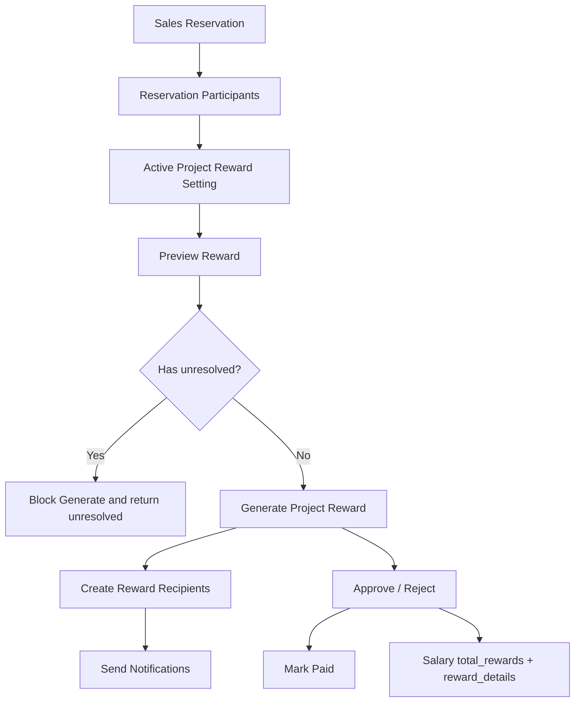
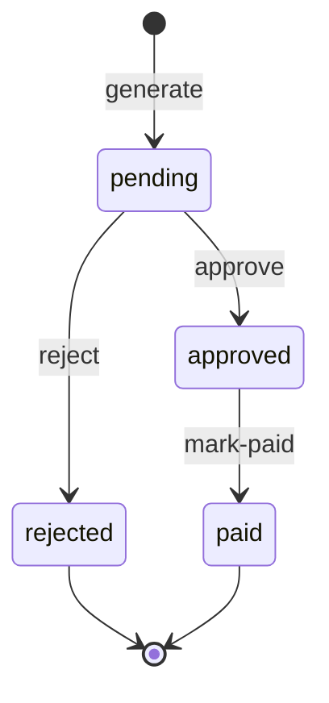
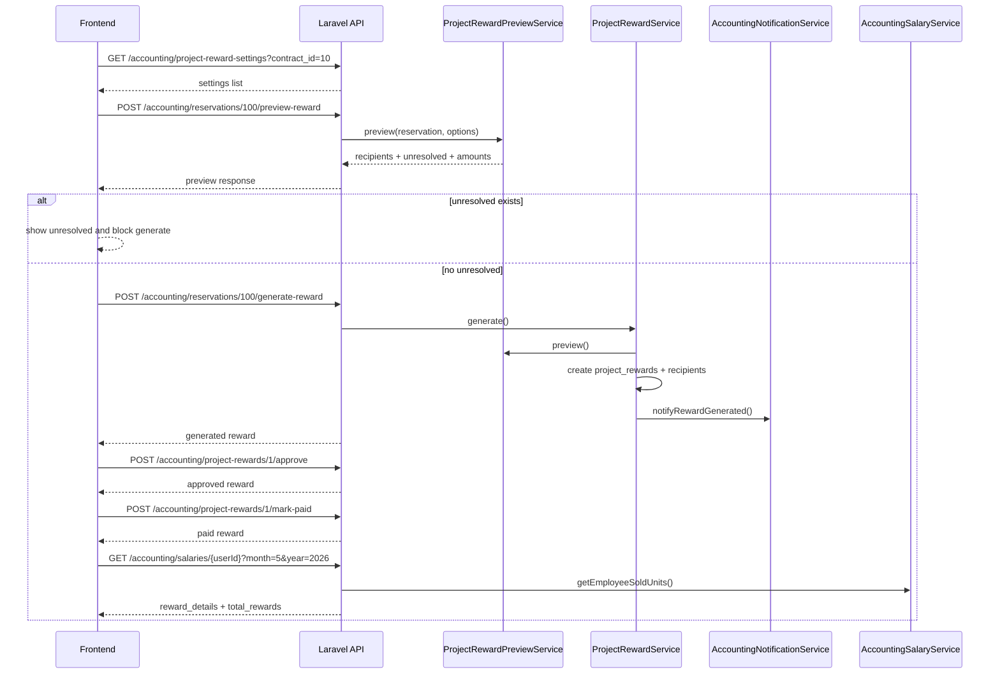

# نظام مكافآت المشاريع — التوثيق الفني الكامل للفرونت والباك — RAKEZ ERP

## 1. الملخص التنفيذي

مكافآت المشاريع هي آلية مستقلة عن العمولات لحساب وتوزيع مكافأة مرتبطة بحجز بيع `SalesReservation` داخل عقد/مشروع `Contract`. المكافأة تعتمد على إعداد فعال لكل مشروع في `project_reward_settings`، ثم يمكن عمل preview للحجز، وبعدها generate لإنشاء سجل فعلي في `project_rewards` وسطور مستفيدين في `project_reward_recipients`.

الفرق الأساسي بينها وبين العمولات أن المكافآت لا تستخدم جدول `commissions` ولا جدول `commission_distributions`، ولا تستعمل إعدادات `project_commission_settings`. المكافآت لها جداولها وخدماتها وواجهاتها الخاصة حتى لا تختلط مع Simple Commission MVP أو التقارير القديمة.

المكافأة ترتبط مباشرة بـ `sales_reservation_id` و`contract_id`. المرشحون للتوزيع يأتون من `sales_reservation_participants` عبر الحقول `did_bring`, `did_convince`, `did_close`, `weight`، مع دعم نسب إدارية مثل `ceo`, `sales_manager`, `sales_leader`, `group_leader`, `external_marketer`.

الضريبة VAT مرجعية محاسبية فقط. الكود يحسب `vat_amount` و`total_amount`، لكن `distribution_pool_amount = base_amount` دائمًا، لذلك لا يتم توزيع VAT على الموظفين.

تظهر المكافآت في الرواتب عبر `AccountingSalaryService`: يتم حساب `total_rewards` من سطور `project_reward_recipients` ذات الحالة `approved` أو `paid` إذا كان parent reward له `approved_at` داخل الشهر المطلوب. ثم يصبح إجمالي الراتب: `base_salary + total_commissions + total_rewards`.

الإشعارات تصل للمستفيدين الداخليين عند توليد المكافأة عبر `AccountingNotificationService::notifyRewardGenerated`. لا توجد إشعارات عند approve/reject/pay حاليًا.

ما لا تلمسه الميزة: لا تعدل `commissions`، لا تعدل `commission_distributions`، لا تولد عمولات، ولا تغير منطق Simple Commission MVP.

## 2. نتيجة الفحص النهائي

Safe to merge: نعم، مع ملاحظات غير حاجبة موثقة أدناه.

الاختبارات التي تم تشغيلها:

```bash
php artisan test tests/Unit/Services/ProjectRewardCalculatorTest.php tests/Feature/Accounting/ProjectRewardSettingPhase1Test.php tests/Feature/Accounting/ProjectRewardPreviewPhase1Test.php tests/Feature/Accounting/ProjectRewardWorkflowPhase2Phase3Test.php tests/Feature/Accounting/AccountingSalaryTest.php tests/Feature/Accounting/UnitCommissionGenerationStage4Test.php tests/Feature/Accounting/SimpleCommissionMvpStage5Test.php tests/Feature/Accounting/AccountingCommissionTest.php
```

النتيجة: `59 passed`, `312 assertions`.

تحذيرات: توجد warnings من PHPUnit عن doc-comment metadata في `AccountingSalaryTest` و`AccountingCommissionTest`. هذه تحذيرات قديمة وغير مرتبطة بالمكافآت.

ملفات الاختبار المطلوبة غير الموجودة بالأسماء التالية:

- `tests/Feature/Accounting/ProjectRewardGenerationPhase2Test.php`: غير منفذ حاليًا في الكود.
- `tests/Feature/Accounting/ProjectRewardNotificationPhase2Test.php`: غير منفذ حاليًا في الكود.
- `tests/Feature/Accounting/ProjectRewardWorkflowPhase3Test.php`: غير منفذ حاليًا في الكود.
- `tests/Feature/Accounting/ProjectRewardSalaryPhase3Test.php`: غير منفذ حاليًا في الكود.

البديل الموجود فعليًا: `tests/Feature/Accounting/ProjectRewardWorkflowPhase2Phase3Test.php` ويغطي generate, notification, approve/reject/pay, salary reward details.

Blockers: لا يوجد blocker مؤكد يمنع الدمج حسب الاختبارات الحالية.

ملاحظات غير حاجبة:

- `notifyRewardGenerated` لا يضع `contract_id` و`sales_reservation_id` داخل `context` للإشعار، لكنه يضع `project_reward_id`, `project_reward_recipient_id`, `amount`, `source_scope`, `source_type`.
- منطق منع إعادة التوليد يفحص آخر reward للحجز فقط. إذا وُجد reward قديم `approved/paid` ثم reward أحدث `rejected`، فقد يسمح الكود بتوليد جديد. هذا يحتاج قرارًا تجاريًا: هل يسمح النظام بأكثر من مكافأة للحجز بعد الرفض؟
- لا يوجد `ProjectRewardGenerationService` أو `ProjectRewardGenerationController`; التوليد منفذ داخل `ProjectRewardService` و`ProjectRewardController`.

الملفات التي تم فحصها: models الخاصة بالمكافآت والرواتب والحجوزات والعمولات، migrations الخاصة بالمكافآت والرواتب والعمولات، services الخاصة بالمكافآت والرواتب والإشعارات، controllers والrequests والresources، `routes/api.php`, `config/ai_capabilities.php`, `RolesAndPermissionsSeeder`, واختبارات المكافآت والعمولات والرواتب.

التوصية النهائية: الميزة جاهزة للتسليم للفرونت وفق هذا العقد الحالي، مع فتح task لاحق لإضافة `contract_id` و`reservation_id` إلى notification context إذا كان الفرونت سيعتمد على context بدل استدعاء تفاصيل reward.

## 3. البنية العامة للميزة

المسار العام:

`SalesReservation → SalesReservationParticipants → ProjectRewardSetting → PreviewReward → ProjectReward → ProjectRewardRecipients → Notifications → Salary total_rewards / reward_details`



المكونات:

- الإعدادات: `ProjectRewardSetting`, `ProjectRewardSettingService`.
- الحساب: `ProjectRewardCalculator`.
- المعاينة: `ProjectRewardPreviewService`.
- التوليد والworkflow: `ProjectRewardService`.
- الاستجابات: `ProjectRewardSettingResource`, `ProjectRewardResource`, `ProjectRewardRecipientResource`.
- الرواتب: `AccountingSalaryService`, `AccountingSalaryDistribution`.
- الإشعارات: `AccountingNotificationService`, `UserNotification`.

## 4. قاعدة البيانات والجداول

جدول `project_reward_settings`:

- `id`
- `contract_id`: FK إلى `contracts`, restrict on delete.
- `calculation_mode`: string، default `percentage_of_sale`.
- `reward_percentage`: decimal nullable.
- `source`: string، default `company`.
- `tax_enabled`: boolean default false.
- `vat_percentage`: decimal default `15.00`.
- نسب المشاركين: `assigned_bring_percentage`, `assigned_convince_percentage`, `assigned_close_percentage`, `outside_bring_percentage`, `outside_convince_percentage`, `outside_close_percentage`.
- مستخدمو الإدارة ونسبهم: `ceo_user_id`, `ceo_percentage`, `sales_manager_user_id`, `sales_manager_percentage`, `sales_leader_user_id`, `sales_leader_percentage`, `group_leader_user_id`, `group_leader_percentage`, `external_marketer_user_id`, `external_marketer_percentage`.
- `is_active`, `created_by`, timestamps, softDeletes.
- indexes: `contract_id`, `contract_id + is_active`.

جدول `project_rewards`:

- `id`
- `sales_reservation_id`: FK إلى `sales_reservations`.
- `contract_id`: FK إلى `contracts`.
- `project_reward_setting_id`: FK nullable إلى `project_reward_settings`.
- `calculation_mode`, `calculation_base_amount`, `reward_percentage`, `source`.
- `base_amount`, `tax_enabled`, `vat_percentage`, `vat_amount`, `total_amount`, `distribution_pool_amount`.
- `status`: string default `pending`.
- `notes`, `created_by`.
- approval fields: `approved_by`, `approved_at`.
- rejection fields: `rejected_by`, `rejected_at`, `rejection_reason`.
- payment fields: `paid_by`, `paid_at`.
- timestamps.
- indexes: reservation, contract, status, approved_at, paid_at.

جدول `project_reward_recipients`:

- `id`
- `project_reward_id`: FK إلى `project_rewards`, cascade on delete.
- `user_id`: FK nullable إلى `users`.
- `recipient_type`: مثل `participant` أو `management` حسب preview.
- `sales_reservation_id`, `sales_reservation_participant_id`.
- `source_scope`: مثل `assigned_project_team`, `outside_project_team`, `management`.
- `source_type`: مثل `bring`, `convince`, `close`, `ceo`, `sales_manager`.
- `percentage`, `amount`, `status`, `notes`.
- approval/rejection/payment fields.
- timestamps.
- indexes: reward, user, status, user+status, approved_at, paid_at.

تعديل `accounting_salary_distributions`:

- تمت إضافة `total_rewards decimal(15,2) default 0`.
- `calculateTotalAmount()` في model أصبح يحسب: `base_salary + total_commissions + total_rewards`.

تأكيد السلامة:

- لا يوجد FK من rewards إلى `commissions`.
- لا يوجد FK من rewards إلى `commission_distributions`.
- لم يتم تعديل جدول `commission_distributions` لأجل المكافآت.

## 5. الموديلات والعلاقات

`ProjectRewardSetting`:

- علاقات: `contract`, `creator`, `ceoUser`, `salesManagerUser`, `salesLeaderUser`, `groupLeaderUser`, `externalMarketerUser`.
- constants: `percentage_of_sale`, `manual_amount`, `developer`, `company`.
- casts: كل النسب decimal، `tax_enabled` و`is_active` boolean.

`ProjectReward`:

- حالات: `pending`, `approved`, `rejected`, `paid`.
- علاقات: `salesReservation`, `contract`, `setting`, `recipients`, `creator`, `approver`, `rejecter`, `payer`.
- helpers: `isPending`, `isApproved`, `isPaid`.

`ProjectRewardRecipient`:

- حالات: `pending`, `approved`, `rejected`, `paid`.
- علاقات: `reward`, `user`, `salesReservation`, `participant`, `approver`, `payer`.

`Contract`:

- علاقات مكافآت: `projectRewardSettings`, `activeProjectRewardSetting`, `projectRewards`.

`SalesReservation`:

- علاقة مكافآت: `projectRewards`.
- علاقة المشاركين: `participantRecords`.

`User`:

- علاقة مكافآت: `projectRewardRecipients`.

## 6. قواعد الحساب

`percentage_of_sale`:

1. يحاول قراءة `reservation.proposed_price` إذا كان أكبر من صفر.
2. إذا لم يوجد، يستخدم `reservation.contractUnit.price` إذا كان أكبر من صفر.
3. إذا فشل الاثنان يرجع 422 برسالة `Unable to resolve sale amount from reservation proposed_price or contract unit price.`

الصيغة:

```text
base_amount = sale_amount * reward_percentage / 100
```

`manual_amount`:

```text
base_amount = manual_amount
calculation_base_amount = manual_amount
reward_percentage = null
```

VAT:

```text
if tax_enabled = false:
  vat_amount = 0
  total_amount = base_amount
  distribution_pool_amount = base_amount

if tax_enabled = true:
  vat_amount = base_amount * vat_percentage / 100
  total_amount = base_amount + vat_amount
  distribution_pool_amount = base_amount
```

مهم للفرونت: لا توزع `total_amount`. التوزيع يتم على `distribution_pool_amount` فقط، وهو حاليًا يساوي `base_amount`.

## 7. إعدادات المكافآت

إنشاء setting جديد مع `is_active=true` يعطل بقية settings لنفس `contract_id`. التفعيل اليدوي عبر endpoint `activate` يعطل siblings ثم يفعل السجل المختار. السجلات المحذوفة soft-deleted يتم تجاهلها في deactivate siblings.

Validation:

- `contract_id`: مطلوب في store، exists في `contracts`.
- `calculation_mode`: `percentage_of_sale` أو `manual_amount`.
- `reward_percentage`: مطلوب فقط إذا `calculation_mode=percentage_of_sale`, numeric بين `0.01` و`100`.
- `source`: `developer` أو `company`.
- `tax_enabled`: boolean nullable.
- `vat_percentage`: numeric nullable بين `0` و`100`.
- كل نسب التوزيع: numeric nullable بين `0` و`100`.
- إذا أي management percentage أكبر من صفر، يجب إرسال user_id المقابل.
- مجموع كل نسب التوزيع يجب ألا يتجاوز `100`.

## 8. Preview

Endpoint المعاينة مرتبط بـ `SalesReservation` وليس بـ `Contract` مباشرة.

المعاينة:

- تحمل `contract.teams`, `activeProjectRewardSetting`, `contractUnit`, `participantRecords.user.team`.
- تفشل إذا لا يوجد عقد للحجز.
- تفشل إذا لا يوجد active reward setting للمشروع.
- تحسب base/VAT/pool.
- تبني recipients preview من المشاركين والإدارة.
- لا تكتب في `project_rewards`.
- لا تكتب في `project_reward_recipients`.
- لا تكتب في `commissions`.
- لا تكتب في `commission_distributions`.

تمييز الفريق:

- إذا `user.team_id` موجود ضمن فرق العقد `contract.teams` يصبح `assigned_project_team`.
- غير ذلك يصبح `outside_project_team`.

مصادر buckets:

- `assigned_project_team + bring`
- `assigned_project_team + convince`
- `assigned_project_team + close`
- `outside_project_team + bring`
- `outside_project_team + convince`
- `outside_project_team + close`
- `management + ceo/sales_manager/sales_leader/group_leader/external_marketer`

الأوزان:

- القيمة تقرأ من `SalesReservationParticipant.weight`.
- إذا كانت `<= 0` يتم التعامل معها كـ `1.0`.
- التقسيم داخل نفس bucket يتم حسب مجموع الأوزان مع rounding لآخر عنصر لتفادي فرق الهللات.

`unresolved`:

- إذا bucket له نسبة أكبر من صفر ولا يوجد مشارك مطابق، يرجع item في `unresolved` بسبب `no_matching_participants`.
- إذا management percentage أكبر من صفر ولا يوجد user loaded، يرجع `missing_management_user`.
- التوليد يمنع وجود unresolved.

## 9. Generate

Generate يستخدم نفس output الخاص بـ preview، ثم يتحقق من سلامة الاستمرار:

- `distribution_pool_amount > 0`.
- لا يوجد unresolved amount.
- مجموع recipients لا يتجاوز pool مع epsilon `0.02`.
- يوجد recipient واحد على الأقل.

ما يقبله الطلب:

- `manual_amount`: اختياري، مطلوب عمليًا إذا setting mode = `manual_amount`.
- `reward_percentage`: اختياري override، numeric من `0.01` إلى `100`.
- `notes`: اختياري string حتى 2000.

ما لا يقبله الطلب:

- لا يقبل custom recipients.
- لا يقبل custom distribution percentages.
- لا يقبل external recipients.
- لا يقبل تغيير source أو tax في generate.

سلوك إعادة التوليد:

- إذا آخر reward لنفس reservation حالته `pending`، يتم حذفه وإنشاء reward جديد.
- إذا آخر reward حالته `approved` أو `paid`، يتم إرجاع 422.
- إذا آخر reward حالته `rejected`، يمكن توليد reward جديد.

ملاحظة audit: الفحص يعتمد على آخر reward فقط، وليس كل rewards السابقة للحجز.

## 10. Workflow والحالات

الحالات الفعلية:

- `pending`: الحالة الافتراضية بعد generate.
- `approved`: بعد approve.
- `rejected`: بعد reject.
- `paid`: بعد mark-paid.

انتقالات الحالة:



قواعد الانتقال:

- approve مسموح فقط من `pending`.
- reject مسموح فقط من `pending`.
- mark-paid مسموح فقط من `approved`.
- reject بعد approved يرجع 422.
- mark-paid قبل approved يرجع 422.

عند approve:

- parent reward يصبح `approved`.
- كل recipients تصبح `approved`.
- يتم تسجيل `approved_by`, `approved_at`.

عند reject:

- parent reward يصبح `rejected`.
- كل recipients تصبح `rejected`.
- يتم تسجيل `rejected_by`, `rejected_at`, `rejection_reason`.

عند mark-paid:

- parent reward يصبح `paid`.
- كل recipients تصبح `paid`.
- يتم تسجيل `paid_by`, `paid_at`.

## 11. APIs والمسارات

كل المسارات التالية تحت:

```text
/api/accounting
```

وتقع داخل route group:

```text
auth:sanctum
role:accounting|admin
```

### Settings List

`GET /project-reward-settings`

Permission: `accounting.project-reward-settings.view`

Query params:

- `contract_id`: اختياري، exists contracts.
- `per_page`: اختياري integer من 1 إلى 100.

Response:

```json
{
  "success": true,
  "data": [
    {
      "id": 1,
      "contract_id": 10,
      "contract": {"id": 10, "project_name": "Project"},
      "calculation_mode": "percentage_of_sale",
      "reward_percentage": 5,
      "source": "company",
      "tax_enabled": true,
      "vat_percentage": 15,
      "assigned_bring_percentage": 10,
      "outside_bring_percentage": 0,
      "ceo_user_id": null,
      "ceo_percentage": 0,
      "is_active": true,
      "created_by": 2,
      "created_at": "2026-05-13T..."
    }
  ],
  "meta": {"current_page": 1, "last_page": 1, "per_page": 15, "total": 1}
}
```

### Create Setting

`POST /project-reward-settings`

Permission: `accounting.project-reward-settings.manage`

Body:

```json
{
  "contract_id": 10,
  "calculation_mode": "percentage_of_sale",
  "reward_percentage": 5,
  "source": "company",
  "tax_enabled": true,
  "vat_percentage": 15,
  "assigned_bring_percentage": 30,
  "assigned_convince_percentage": 20,
  "assigned_close_percentage": 10,
  "outside_bring_percentage": 0,
  "outside_convince_percentage": 0,
  "outside_close_percentage": 0,
  "ceo_user_id": 1,
  "ceo_percentage": 5,
  "is_active": true
}
```

Status: `201`.

### Show Setting

`GET /project-reward-settings/{projectRewardSetting}`

Permission: `accounting.project-reward-settings.view`

### Update Setting

`PUT /project-reward-settings/{projectRewardSetting}`

Permission: `accounting.project-reward-settings.manage`

Body: نفس حقول create لكن كلها اختيارية حسب `UpdateProjectRewardSettingRequest`.

### Activate Setting

`POST /project-reward-settings/{projectRewardSetting}/activate`

Permission: `accounting.project-reward-settings.manage`

Body: لا يوجد.

### Preview Reward

`POST /reservations/{reservation}/preview-reward`

Permission: `accounting.project-rewards.view`

Body:

```json
{
  "manual_amount": 50000,
  "reward_percentage": 5
}
```

الحقول اختيارية في request، لكن `manual_amount` مطلوب عمليًا إذا setting mode = `manual_amount`.

Response:

```json
{
  "success": true,
  "data": {
    "reservation_id": 100,
    "contract_id": 10,
    "project_reward_setting_id": 7,
    "calculation_mode": "percentage_of_sale",
    "calculation_base_amount": 1000000,
    "reward_percentage": 5,
    "source": "company",
    "base_amount": 50000,
    "tax_enabled": true,
    "vat_percentage": 15,
    "vat_amount": 7500,
    "total_amount": 57500,
    "distribution_pool_amount": 50000,
    "recipients": [
      {
        "user_id": 20,
        "recipient_type": "participant",
        "sales_reservation_id": 100,
        "sales_reservation_participant_id": 55,
        "user": {"id": 20, "name": "User"},
        "source_scope": "assigned_project_team",
        "source_type": "bring",
        "percentage": 30,
        "amount": 15000
      }
    ],
    "unresolved": [],
    "total_distributed": 15000,
    "remaining_amount": 35000
  }
}
```

### Generate Reward

`POST /reservations/{reservation}/generate-reward`

Permission: `accounting.project-rewards.manage`

Body:

```json
{
  "manual_amount": 50000,
  "reward_percentage": 5,
  "notes": "optional"
}
```

Status: `201`.

Response: `ProjectRewardResource` مع `recipients`.

### List Rewards

`GET /project-rewards`

Permission: `accounting.project-rewards.view`

Query params:

- `contract_id`: اختياري exists contracts.
- `sales_reservation_id`: اختياري exists sales_reservations.
- `status`: اختياري `pending|approved|rejected|paid`.
- `per_page`: اختياري integer 1..100.

### Show Reward

`GET /project-rewards/{projectReward}`

Permission: `accounting.project-rewards.view`

Response shape:

```json
{
  "success": true,
  "data": {
    "id": 1,
    "sales_reservation_id": 100,
    "contract_id": 10,
    "project_reward_setting_id": 7,
    "contract": {"id": 10, "project_name": "Project"},
    "reservation": {"id": 100, "client_name": "Client", "status": "confirmed", "proposed_price": 1000000},
    "calculation_mode": "percentage_of_sale",
    "calculation_base_amount": 1000000,
    "reward_percentage": 5,
    "source": "company",
    "base_amount": 50000,
    "tax_enabled": true,
    "vat_percentage": 15,
    "vat_amount": 7500,
    "total_amount": 57500,
    "distribution_pool_amount": 50000,
    "status": "pending",
    "notes": null,
    "created_by": 2,
    "approved_by": null,
    "approved_at": null,
    "rejected_by": null,
    "rejected_at": null,
    "rejection_reason": null,
    "paid_by": null,
    "paid_at": null,
    "recipients": []
  }
}
```

### Approve Reward

`POST /project-rewards/{projectReward}/approve`

Permission: `accounting.project-rewards.approve`

Body: لا يوجد.

Allowed: فقط إذا `status=pending`.

### Reject Reward

`POST /project-rewards/{projectReward}/reject`

Permission: `accounting.project-rewards.approve`

Body:

```json
{
  "reason": "optional rejection reason"
}
```

Allowed: فقط إذا `status=pending`.

### Mark Reward Paid

`POST /project-rewards/{projectReward}/mark-paid`

Permission: `accounting.project-rewards.pay`

Body: لا يوجد.

Allowed: فقط إذا `status=approved`.

## 12. Salary APIs

`GET /salaries`

Permission: `accounting.salaries.view`

Query:

- `month`: required numeric 1..12.
- `year`: required numeric 2020..2100.
- `type`: nullable string.
- `team_id`: nullable exists teams.
- `commission_eligible`: nullable boolean.

Reward fields added to each employee row:

```json
{
  "total_commissions": 1000,
  "total_rewards": 50000,
  "total_amount": 61000,
  "reward_details": {
    "by_project": [
      {
        "project_name": "Project",
        "total_rewards": 50000,
        "details": [
          {
            "project_reward_id": 1,
            "project_reward_recipient_id": 1,
            "project_name": "Project",
            "unit_number": "U-101",
            "source": "company",
            "source_scope": "assigned_project_team",
            "source_type": "bring",
            "percentage": 100,
            "amount": 50000,
            "status": "approved",
            "approved_at": "2026-05-13 00:00:00",
            "paid_at": null
          }
        ]
      }
    ],
    "total_rewards": 50000
  }
}
```

`GET /salaries/{userId}`

Permission: `accounting.salaries.view`

يعيد `reward_details`, `rewards_total`, و`summary.total_rewards`.

`POST /salaries/{userId}/distribute`

Permission: `accounting.salaries.distribute`

عند إنشاء salary distribution يتم تخزين `total_rewards` داخل `accounting_salary_distributions`.

مهم: المكافآت الداخلة في الراتب هي recipients ذات status `approved` أو `paid`، ويجب أن يكون `project_rewards.approved_at` داخل الشهر المطلوب. `pending` و`rejected` لا تدخل في الراتب.

## 13. الإشعارات

عند generate:

- ينادي `ProjectRewardService::generate` بعد transaction: `AccountingNotificationService::notifyRewardGenerated`.
- ينشئ `UserNotification` لكل recipient لديه `user_id`.
- لا يوجد دعم external recipient حاليًا، ولا يوجد `external_name` في جدول `project_reward_recipients`.

شكل الإشعار:

```json
{
  "user_id": 20,
  "message": "تم إنشاء مكافأة لك بمبلغ ...",
  "status": "pending",
  "event_type": "reward_generated",
  "context": {
    "project_reward_id": 1,
    "project_reward_recipient_id": 1,
    "amount": 50000,
    "source_scope": "assigned_project_team",
    "source_type": "bring"
  }
}
```

غير موجود حاليًا في context:

- `contract_id`: غير منفذ حاليًا في الكود.
- `sales_reservation_id`: غير منفذ حاليًا في الكود.

إشعارات approve/reject/pay: غير منفذة حاليًا في الكود.

## 14. الصلاحيات

تعتمد مسارات المكافآت على `auth:sanctum`, `role:accounting|admin`، ثم permission middleware.

Permissions:

- `accounting.project-reward-settings.view`
- `accounting.project-reward-settings.manage`
- `accounting.project-rewards.view`
- `accounting.project-rewards.manage`
- `accounting.project-rewards.approve`
- `accounting.project-rewards.pay`
- `accounting.salaries.view`
- `accounting.salaries.distribute`

الأدوار حسب `config/ai_capabilities.php`:

- `admin`: يحصل على كل الصلاحيات عبر seeder و`Gate::before`.
- `accounting`: يملك view/manage/approve/pay للمكافآت.
- `accountant`: يملك view وapprove، ولا يملك manage أو pay حسب config الحالي، لكن route group لا يسمح إلا بـ `accounting|admin`، لذلك `accountant` لا يصل لهذه routes إلا إذا تغير route group.
- `sales`, `sales_leader`, `sales_manager`: لا توجد صلاحيات مكافآت في config الحالي.

جدول مختصر:

| Action | Admin | Accounting | Accountant | Sales |
|---|---:|---:|---:|---:|
| View settings | نعم | نعم | config: نعم، route: لا | لا |
| Manage settings | نعم | نعم | لا | لا |
| Preview reward | نعم | نعم | config: نعم، route: لا | لا |
| Generate reward | نعم | نعم | لا | لا |
| Approve/reject | نعم | نعم | config: نعم، route: لا | لا |
| Mark paid | نعم | نعم | لا | لا |
| Salary reward details | نعم | نعم | route: لا | لا |

## 15. أخطاء وحالات فشل مهمة للفرونت

422 validation:

- setting percentages total exceeds 100: field `distribution_total`.
- management percentage > 0 بدون user_id.
- `reward_percentage` missing مع `percentage_of_sale`.
- `manual_amount` missing أو <= 0 مع `manual_amount`.
- لا يوجد active setting: field `project_reward_setting`.
- لا يمكن resolve sale amount: field `sale_amount`.
- generate مع unresolved: field `unresolved`.
- generate بدون recipients: field `recipients`.
- generate إذا آخر reward للحجز approved/paid: field `project_reward`.
- approve/reject لغير pending: field `status`.
- mark-paid لغير approved: field `status`.

403:

- المستخدم لا يملك permission المطلوب.
- المستخدم خارج route role `accounting|admin`.

404:

- route model binding إذا `reservation` أو `projectReward` أو `projectRewardSetting` غير موجود.

## 16. تدفق الفرونت المقترح

1. صفحة إعدادات المكافآت:
   افتح `GET /api/accounting/project-reward-settings?contract_id={id}`.

2. إنشاء/تعديل setting:
   استخدم `POST` أو `PUT` مع توزيع النسب. يجب على الواجهة حساب مجموع النسب محليًا وإظهار تنبيه إذا تجاوز 100 قبل إرسال الطلب.

3. اختيار حجز:
   من شاشة حجوزات المشروع أو sold units، استخدم `sales_reservation_id`.

4. معاينة:
   أرسل `POST /api/accounting/reservations/{reservation}/preview-reward`.
   إذا mode يدوي، أرسل `manual_amount`.

5. التعامل مع unresolved:
   إذا `unresolved` غير فارغ، لا تعرض زر generate كإجراء نهائي أو اعرضه disabled. الكود سيمنع generate.

6. توليد:
   أرسل `POST /api/accounting/reservations/{reservation}/generate-reward`.

7. مراجعة reward:
   اعرض `GET /api/accounting/project-rewards/{projectReward}`.

8. الموافقة أو الرفض:
   إذا `status=pending`، اعرض أزرار approve/reject حسب الصلاحية.

9. الدفع:
   إذا `status=approved`، اعرض زر mark-paid حسب الصلاحية.

10. الرواتب:
   في شاشة الرواتب، اعرض `total_rewards` و`reward_details` بجانب `total_commissions`.

## 17. Sequence Diagram للفرونت والـ API



## 18. علاقة المكافآت بالعمولات وSimple Commission MVP

تم التأكد من الآتي:

- `ProjectRewardService` لا يستخدم `Commission`.
- `ProjectRewardService` لا ينشئ `CommissionDistribution`.
- preview/generate للمكافآت يستخدمان `SalesReservationParticipant` فقط كمصدر للمستفيدين.
- اختبارات `UnitCommissionGenerationStage4Test` و`SimpleCommissionMvpStage5Test` نجحت بعد إضافة المكافآت.
- `AccountingCommissionTest` نجح بعد إضافة المكافآت.

المكافآت والعمولات يشتركان في مصدر participants فقط، ولا يشتركان في جداول أو generation logic.

## 19. endpoints غير منفذة حاليًا

- `ProjectRewardGenerationController`: غير منفذ حاليًا في الكود. التوليد موجود في `ProjectRewardController@generate`.
- `ProjectRewardGenerationService`: غير منفذ حاليًا في الكود. التوليد موجود في `ProjectRewardService`.
- endpoint لإضافة recipients يدويًا: غير منفذ حاليًا في الكود.
- endpoint لتعديل recipients يدويًا: غير منفذ حاليًا في الكود.
- endpoint لحذف recipients يدويًا: غير منفذ حاليًا في الكود.
- endpoint لإرسال إشعار عند approve/reject/pay: غير منفذ حاليًا في الكود.
- endpoint لتقارير مكافآت مستقلة: غير منفذ حاليًا في الكود.

Expected future endpoints إذا احتاجها المنتج:

- `POST /api/accounting/project-rewards/{reward}/recipients`
- `PUT /api/accounting/project-rewards/{reward}/recipients/{recipient}`
- `DELETE /api/accounting/project-rewards/{reward}/recipients/{recipient}`
- `GET /api/accounting/project-rewards/reports`

## 20. مخاطر وملاحظات قبل تسليم الفرونت

- يجب أن يتعامل الفرونت مع `unresolved` كحالة تمنع generate.
- لا تعتمد الواجهة على `total_amount` كتوزيع، بل على `distribution_pool_amount`.
- `reward_percentage` override مسموح في preview/generate حسب request الحالي، حتى لو setting لديه percentage.
- لا يوجد دعم recipients مخصصين من الفرونت.
- لا يوجد دعم external recipients.
- `accountant` موجود في config لبعض صلاحيات view/approve، لكن route group يمنعه حاليًا لأنه ليس ضمن `role:accounting|admin`.
- notification context لا يحتوي `contract_id` و`reservation_id` حاليًا.
- approve/reject/pay لا ترسل notifications.
- إذا كان المطلوب منع أي reward جديد لحجز لديه أي reward approved/paid سابقًا، فالكود الحالي يحتاج تعديل لأنه يفحص آخر reward فقط.

## 21. خلاصة Backend Handoff

الميزة مكتملة كمسار backend مستقل:

- إعدادات لكل عقد/مشروع.
- Preview قائم على الحجز والمشاركين.
- Generate ينشئ reward وrecipients من preview.
- Workflow: pending ثم approved/rejected ثم paid.
- Salary integration عبر `total_rewards` و`reward_details`.
- Notification عند generate فقط.
- لا يوجد coupling مع commissions أو commission_distributions.

تسليم الفرونت يجب أن يبدأ من شاشة إعدادات المكافآت ثم شاشة معاينة الحجز ثم شاشة إدارة rewards ثم عرض المكافآت داخل الرواتب.
