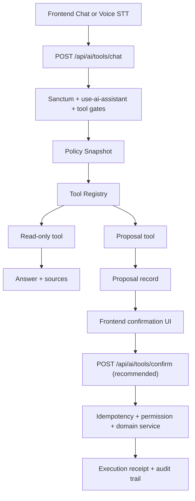

# AI Agentic Architecture

## Goal
Define a safe Laravel-native target architecture in which the AI assistant is ERP-grounded, permission-aware, voice-compatible, auditable, and able to move from read-only assistance to human-confirmed ERP actions.

## Current State

### Verified
- Primary classes:
  - `App\Services\AI\AIAssistantService`
  - `App\Services\AI\RakizAiOrchestrator`
  - `App\Services\AI\ToolRegistry`
  - `App\Services\AI\Policy\RakizAiPolicyContextBuilder`
  - `App\Services\AI\AiAuditService`
- Current AI API families:
  - legacy assistant: `App\Http\Controllers\AI\AIAssistantController`
  - strict tool orchestration: `App\Http\Controllers\AI\AiV2Controller`
  - knowledge-base assistant: `App\Http\Controllers\AI\AssistantChatController`
- Current orchestrated tools are read/advisory only.
- Permission enforcement exists at route level, tool allowlist level, and some individual tool level.
- Audit trail and interaction logs already exist.

### Constraint
There is no verified proposal store or execution-confirmation endpoint. That means the backend is not yet a safe action-executing agent.

## Target Architecture

### 1. One primary chat API
Recommended primary endpoint:
- `POST /api/ai/tools/chat` as the long-term canonical AI endpoint.

Required request shape:
```json
{
  "message": "Arabic or English user message",
  "conversation_id": "uuid-or-null",
  "locale": "ar",
  "context": {
    "module": "sales",
    "entity_type": "project",
    "entity_id": null
  },
  "input_mode": "text"
}
```

Why:
- It aligns with the tool-aware architecture already present in `App\Http\Controllers\AI\AiV2Controller`.
- It gives frontend one stable contract for text and voice-transcribed input.

### 2. Tool registry split by risk

#### Read-only tools
Allowed to execute immediately after permission checks.

Examples:
- `lead.get_summary`
- `contract.get_status`
- `records.search`
- `marketing.analytics`
- `sales.kpi`
- `ai_calls.status`
- `documents.search`

Current verified analogs:
- `tool_get_lead_summary`
- `tool_get_contract_status`
- `tool_search_records`
- `tool_marketing_analytics`
- `tool_kpi_sales`
- `tool_ai_call_status`
- `tool_rag_search`

#### Proposal tools
Allowed to compute a proposed ERP mutation but not execute it.

Examples:
- `lead.assign.propose`
- `reservation.confirm.propose`
- `deposit.refund.propose`
- `campaign.sync.propose`

Current verified state:
- Not implemented as first-class tools.

#### Safe write tools
Allowed to execute only after confirmation, idempotency, and policy checks.

Examples:
- `lead.assign.execute`
- `reservation.confirm.execute`
- `task.create.execute`

Current verified state:
- Not implemented.

### 3. Human confirmation flow

Recommended contract:
1. AI chat returns `proposals[]`.
2. Frontend shows human-readable summary and payload preview.
3. User confirms.
4. Frontend sends confirmation request with `proposal_id` and `idempotency_key`.
5. Backend executes the ERP action through a dedicated application service.
6. Backend stores execution outcome and audit trail.

Recommended request:
```json
{
  "proposal_id": "uuid",
  "confirm": true,
  "idempotency_key": "uuid"
}
```

Recommended response:
```json
{
  "success": true,
  "data": {
    "proposal_id": "uuid",
    "execution_id": "uuid",
    "status": "completed",
    "result": {
      "entity_type": "lead",
      "entity_id": 123
    }
  }
}
```

### 4. Required persistence additions

#### Recommended table: `ai_action_proposals`
Columns:
- `id`
- `conversation_id`
- `user_id`
- `action`
- `summary`
- `payload_json`
- `risk_level`
- `requires_confirmation`
- `status`
- `expires_at`
- `approved_at`
- `approved_by_user_id`
- `rejected_at`
- `executed_at`
- `execution_error`
- `correlation_id`

#### Recommended table: `ai_action_executions`
Columns:
- `id`
- `proposal_id`
- `idempotency_key`
- `executor_user_id`
- `service_class`
- `status`
- `request_payload`
- `response_payload`
- `started_at`
- `finished_at`
- `correlation_id`

Reason:
- Current `ai_audit_trail` is not sufficient as the primary execution ledger.

### 5. Permission map

Recommended enforcement order:
1. Route auth via Sanctum.
2. Assistant access via `use-ai-assistant`.
3. Tool-level allowlist.
4. Business permission check per action.
5. Data boundary validation per entity ownership/scope.
6. Confirmation requirement by risk.
7. Idempotency check before execution.

### 6. Data access boundaries by role

Rules:
- Sales users should remain scoped to own or allowed leads/reservations unless a stronger permission exists.
- Marketing users should access campaign/lead/reporting data only through `marketing.ads.view` or `marketing.ads.manage`.
- Admin bypass may remain, but execution audit must still record the exact permission path used.

Verified references:
- `App\Services\AI\Tools\GetLeadSummaryTool`
- `App\Services\AI\Tools\SearchRecordsTool`
- `App\Providers\AppServiceProvider::boot()`

### 7. Arabic/English response contract
Recommended normalized fields:
- `locale`
- `answer`
- `answer_markdown`
- `proposals`
- `sources`
- `links`
- `warnings`

Current verified state:
- `App\Http\Requests\AI\AssistantChatRequest` supports `language` `ar|en`.
- `App\Services\AI\SystemPromptBuilder` says to respond in the same language as the user.
- `App\Services\AI\RakizAiOrchestrator::buildInstructions()` contains Arabic-first behavior rules.
- The contract is not unified across all AI endpoints.

### 8. Voice-compatible chat
Recommended rule:
- Frontend speech-to-text should send transcribed text to the same chat endpoint.
- The backend should treat `input_mode=voice` as metadata, not a separate business flow.

Recommended payload:
```json
{
  "message": "Frontend-transcribed voice text goes here",
  "conversation_id": "uuid",
  "locale": "ar",
  "input_mode": "voice",
  "context": {
    "module": "sales"
  }
}
```

Current verified state:
- Feasible by convention because existing endpoints accept text.
- Not yet formalized in validation classes.

## Recommended Flow



## What Should Not Happen
- The LLM should not directly call ERP mutating services.
- The frontend should not interpret advisory `suggested_actions` as executable commands.
- Route auth alone should not be treated as sufficient authorization for AI tool execution.

## Migration Path
1. Keep existing `/api/ai/chat` stable for backward compatibility.
2. Standardize new frontend work on `/api/ai/tools/chat`.
3. Add proposal storage and confirmation endpoint.
4. Convert future write tools to proposal-first.
5. Deprecate overlapping assistant chat variants only after frontend migration.
